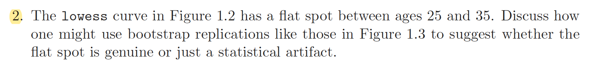
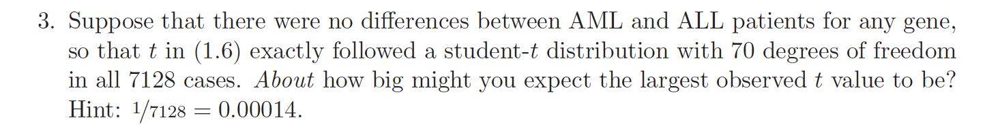
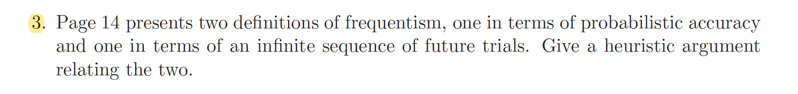
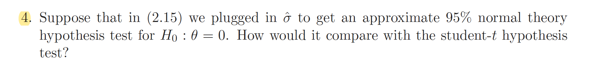

```{r setup, include=FALSE}
knitr::opts_chunk$set(echo = TRUE)
```

<br>

### Exercise 1.2



```{r}
kidney <-
read.table('https://web.stanford.edu/~hastie/CASI_files/DATA/kidney.txt', header=T)

fit=lowess(kidney$age, kidney$tot, f=1/3)

plot(kidney, xlab='age', ylab='tot')
lines(fit, lwd=2, col='blue')
abline(v=c(25, 35))
title(main='Reproducing Figure 1.2 in the textbook')
```

<br>

  As we see in the plot above, which is almost same as figure 1.2, a flat spot of lowess fit curve between ages 25 and 35 is observed.  
To inspect whether this is genuine or just a statistical artifact, we can suggest a method using bootstrap replications.  
  What we implement in the following code is  

1. Produce 1000 bootstrap datasets by resampling 157 pairs of $(x_i, y_i)$ from the original 157 with replacement.
2. To measure "how flat the region is", we suggest $$F_s=\sum_{i=0}^{9} |y_{i+s}^*-y_{i+s+1}^*|$$ where $s$ is a starting index and $y_j^*$ is a lowess fit value of $y$ corresponding to $x=j$ in each bootstrap replication. Our main target region is $[25,35]$, so we will focus on the case of $s=25$
3. When calculating $F_s$, if there is no datapoint satisfying $x=j$ in bootstrap replication for some $j\in \{s, s+1, \cdots, s+10\}$, then we calculate average instead of sum and then multiply 10. 
4. Aggregate 1000 values of $F_s$ with $s=25$ from each bootstrap replication.
5. Draw a histogram of those 1000 values and compare it to other $F_s$ values for another region as $[15,25], [35, 45], [40, 50], [45, 55], [55, 65], [60. 70]$ which are calculated from the original dataset.     

<br>

```{r }
# Plotting scatter plot and lowess fit from original data
plot(kidney, xlab='age', ylab='tot')
lines(fit, lwd=2)

# "Results" variable will store 1000 values of F_{s=25} values
results=0
set.seed(123)
for(i in 1:1000){
  # bootstrap resampling
  bootindex=sample(1:157, 157, replace=T)
  bootdat=kidney[bootindex,]
  bootfit<-lowess(bootdat$age, bootdat$tot, f=1/3)
  # drawing a lowess fit from bootstrap resampling data
  # reproducing a figure 1.3 in the textbook
  lines(bootfit, col=colors()[5*i])
  
  # Calculating F_{s=25} value for each bootstrap replication.
  target=NULL
  for(j in seq(25, 35, by=1)){
    if(j %in% bootfit$x) {
    target=append(target, bootfit$y[match(j, bootfit$x)])
    }
  }
  result = mean(abs(diff(target)))*10
  results[i]=result
}
title(main='Reproducing Figure 1.3 in the textbook')
```
```{r}
#Drawing histograms for 1000 values of F_{s=25} 
hist(results, breaks=20, xlim=c(0,4), 
     main='Histogram for measurements of how flat the region [25,35] is', 
     xlab='F_25 values')

# To compare with other regions, calculate F_s for different s values.
# This calculation is implemented only from the original dataset.
compare = NULL

for(i in c(15, 35, 40, 45, 50, 55, 60)){
  target=NULL
  for(j in i:(i+10)){
    if(j %in% fit$x){
      target=append(target, fit$y[match(j, fit$x)])
      result= mean(abs(diff(target)))*10
    }
  }
  compare=append(compare, result)
  
}

# Draw vertical lines of those F_s values of other regions over the histogram.
abline(v=compare, col='red', lwd=1.5)


```
<br>

  From the design of $F_s$, the small value of $F_s$ implies that the region $[s, s+10]$ is flat. If a flat spot between ages 25 and 35 was genuine then those $F$ values would be much smaller than $F$ values corresponding to other regions. But as we can see from the histogram above, more than half of 1000 bootstrap replications yield $F$ values for the region $[25,35]$ bigger than $F$ values for the other regions except only one region ( which is $[18, 28]$ ). Observing this result, we can suggest that the flat spot between ages 25 and 35 is not quite genuine.  

<br>

### Exercise 1.3


  For the given problem, we have 7128 $t_i$'s, which are identically distributed as $t$-distribution with 70 degrees of freedom. 
If we asssume additionally those 7128 genes are independent, then we can expect that $P(T>t_{(N)})\cong \frac{1}{N+1}$ where $t_{(1)}<t_{(2)}<\cdots<t_{(i)}<\cdots<t_{(N)}$ with $N=7128$ and $T\sim t(70)$. Indeed, the idea is that all the regions $(-\infty, t_{(1)}), (t_{(1)}, t_{(2)}), \cdots, (t_{(i)}, t_{(i+1)}), \cdots, (t_{(N-1)}, t_{(N)})$ and $(t_{(N)}, \infty)$ should have equal probability i.e. for any interval $I$ among those N+1 number of $(t_{(i)}, t_{(i+1)})$'s, $P(T\in I)$ should be similar to $\frac{1}{N+1}$

```{r}
N=7128
qt(1/(N+1), df=70, lower.tail=F)
qnorm(1/(N+1), lower.tail=F)

```

  Calculating $\frac{1}{N+1}$-quantile of $t$-distribution with 70 d.f., we expect that the value of $t_{(N)}$, which is the largest observed $t$ value, is similar to 3.825. For a just comparison, if every $t_i$'s were distributed as $N(0,1)$ rather than $t$ distribution, then we might expect that the value of $t_{(N)}$ is similar to 3.633. This difference is due to heavy tail of t-distribution compared to standard normal.

<br>

### Exercise 2.3



Two definitions of frequentism suggested in the textbook are    

1. The accuracy of an observed estimate $\hat{\theta}=t(x)$ is the probabilistic accuracy of $\hat{\Theta}=t(X)$ as an estimator of $\theta$
2. Imagine hypothetical data sets $X^{(1)}, X^{(2)}, X^{(3)}, \cdots$ generated by the same mechanism as $x$ providing corresponding values $\hat{\Theta}^{(1)}, \hat{\Theta}^{(2)}, \hat{\Theta}^{(3)}, \cdot$s where $\hat{\Theta}^{(k)}=t(X^{(k)})$    

 What we have is a dataset $X$ and observed value $x$ of $X$. Our goal is to estimate target parameter $\theta$. We use estimate $\hat{\theta}=t(x)$ to fulfill our goal. The problem is that we want to know the accuracy of our estimate value $\hat{\theta}$. Note that $X=x$ is observed this time, but in another experiment, observed value of $X$ might be different according to probabilistic property of $X$. This logic applies same to $\hat{\Theta}=t(X)$ and $\theta=t(x)$. $\theta=t(x)$ is observed in this time, but $\hat{\Theta}=t(X)$ can be observed as different values according to its probabilistic property in another experiment.  
  In the view of frequentism, we can measure the accuracy of $\hat\theta=t(x)$ which is from our given data, by calculating probabilistic accuracy of $\hat\Theta=t(X)$ which is not from our given data. Typically, the probabilistic accuracy of $\hat\Theta=t(X)$ is measured by a standard error. $$ SE(\hat\Theta)=\sqrt{Var(\hat\Theta)}$$ 
  Probabilistic properties like standard error can be understood as the statistics (in this case, a standard deviation) of infinitely many $\hat\Theta$ values yielded from hypothetical inifinite sequence of future experiments.  
  As an example, consider a situation where we observe an $i.i.d$ sample $X$ of size 20 which is distributed as $N(5,4)$. Our target parameter is normal mean $\mu=5$ which is assumed to be unknown as well as normal variance $\sigma^2=4$. What we can observe is one set of given sample $X=x$ and the observed estimate sample mean $\hat\mu=\overline{X}$. But for calculating accuracy of this observed estimate, we use hypothetical infinite sequence of datasets which are generated same way as $X$ and corresponding estimate $\hat\mu$. Standard error of our $\hat\mu$ is measured by standard deviation of inifinitely many $\hat\mu$'s generated from inifinite sequence of hypothetical experiments.  
```{r}
set.seed(100)

n=20
x=rnorm(n, mean=5, sd=2)  # Observed sample.
mu.hat=mean(x)  # Our estimate for target parameter mu.

# This vector will store infinitely many hypothetical mu.hat's 
mu.hat_hypo.seq=0  

# Since we cannot use the Infinite number, replace it by one million.
N=1000000 
for(i in 1:N){
  x_hypo=rnorm(n, mean=5, sd=2)
  mu.hat_hypo=mean(x_hypo)
  mu.hat_hypo.seq[i]=mu.hat_hypo

}

hist(mu.hat_hypo.seq, main='Distribution of hypothetically generated mu.hat\'s')

# If N is truly infinite, then this is understood as standard error of mu.hat
sd(mu.hat_hypo.seq)  

# Since we know true standard error of mu.hat, compare it with above
(true.se=2/sqrt(n))

```

<br>

### Exercise 2.4



What we get in (2.15) is that under $H_0$, $$\hat\theta\sim N\Big(0, \sigma^2(\frac{1}{n_1}+\frac{1}{n_2})\Big)$$ 
The unbiased estimate of $\sigma^2$ is pooled sample variance $\hat\sigma^2$  
Hence, under $H_0$, $$t=\frac{\overline{x}_2-\overline{x}_1}{\widehat{sd}}\sim t(n_1+n_2-2)\quad \; where \quad \widehat{sd}=\hat\sigma\Big(\frac{1}{n_1}+\frac{1}{n_2}\Big)$$
Note that this is the exact distribution, not the approximate one.
On the other hand, if we plug in $\sigma^2=\hat\sigma^2$ in (2.15) then we get approximate distribution of $\hat\theta$, which is $$\hat\theta\approx N\Big(0, \hat\sigma^2(\frac{1}{n_1}+\frac{1}{n_2})\Big)$$  
By scaling, what we get is under $H_0$, $$t=\frac{\overline{x}_2-\overline{x}_1}{\widehat{sd}}\approx N(0,1)$$
Note that this is not the exact distribution but the approximate one. Since those two tests ( t-test and normal z-test using approximate distribution ) have same test statistic $t$, the only difference is the distribution ; $t(n_1+n_2-2)$ vs $N(0,1)$. It is known that $t$-distribution has heavier tail than standard normal, so for the same observed data, t-test would yield larger p.value than z-test. This means that z-test using approximate distribution could reject the null hypothesis while t-test does not reject. Since t-test use the exact distribution while z-test uses approximate one, we can say t-test is more "correct" than z-test. Hence, in the situation I've just mentioned above, using z-test can cause claiming the significant difference between two groups where in fact, difference between two groups is not statistically significant.

```{r sleep , message=FALSE, warning=FALSE}
library(dplyr) 
gr1 = sleep %>% filter(group==1) ;gr1 <- gr1[,1]   # First group observed
gr2 = sleep %>% filter(group==2) ; gr2<- gr2[,1]   # Second group observed
n1=length(gr1) ; n2=length(gr2)

xbar1<-mean(gr1)
xbar2<-mean(gr2)
# our estimate for theta
theta.hat<-xbar2-xbar1   
# square root of pooled sample variance is estimate of sigma
sigma.hat<-sqrt(((n1-1)*var(gr1)+(n2-1)*var(gr2))/(n1+n2-2)) 
# our test statistic
tstat=theta.hat/(sigma.hat*sqrt(1/n1+1/n2))
```
```{r}
(pvalue_ttest<-2*pt(tstat, df=n1+n2-2, lower.tail=F))
(pvalue_ztest<-2*pnorm(tstat, lower.tail=F))

```

From the simple example above, we can see that pvalue produced from z-test is smaller than t-test. Hence z-test using approximate normal distribution may bring about rejection of null hypothesis even when there is no significant difference between two groups.