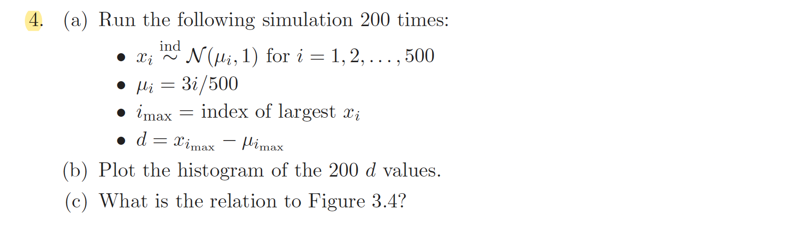

```{r setup, include=FALSE}
knitr::opts_chunk$set(echo = TRUE)
```

<br>

### Exercise 3.4

 

```{r}
set.seed(123)
d=0
for(k in 1:200){  # 200 times of simulation
  x=0
  for(i in 1:500){  # the number of sample x_i's is 500
    mu=3 * i / 500  # mu_i
    x[i] = rnorm(1, mean=mu, sd=1)  # sample x_i from N( mu_i, 1 )
  }
  d[k] = x[which.max(x)] - 3 * which.max(x) /500  # x_{i_max} - mu_{i_max}
}
summary(d)
```
```{r echo=F}
d = as.data.frame(d)
library(ggplot2)
ggplot(d, aes(x=d))+geom_histogram(bins=35, fill='black', col='yellow')+ggtitle('Histogram of 200 d values')+theme(plot.title = element_text(color='blue', hjust=0.5, size= 20, face= 'bold'))
```

In figure 3.4 , we can see the histogram of unbiased effect-size estimates for 6033 genes. A model for the effect-size $x_i$ for $i$-th gene is $$X_i\sim N(\mu_i, 1)\quad \quad i=1,2,\cdots, N(=6033)$$ Observed maximum value of $x_i$ among 6033 values is $x_{610}=5.29\;$. Textbook claims that $x_{610}=5.29$ was likely to be an overestimate of an effect-size $\mu_{610}$. Why?  
It is true that $x_{610}$ is individually unbiased for $\mu_{610}$ because $E[X_i]=\mu_i$. However, if we see this same value $x_{610}=5.29$ as $\max_{\{i=1,\cdots, N\}} x_i$, then we can figure out why it is overestimate for $\mu_{610}$. Since $\max_{\{i=1,\cdots, N\}} X_i> X_j\quad \forall\; j=1, \cdots, N$ ,   $$E\Big[\max_{\{i=1,\cdots, N\}}X_i\Big]>E[X_j]=\mu_j \quad, \quad E\Big[\max_{\{i=1,\cdots, N\}}X_i-\mu_j \Big]>0 \quad \forall \; j=1,\cdots, N$$ Therefore $$ E\big[X_{i_{\max}}-\mu_{i_{\max}} \big]>0$$
Indeed 200 d values in this exercise was simulated samples of $X_{i_{\max}}-\mu_{i_{\max}}$ assuming $\mu_j=3j\;/\;500 \quad\forall\; j$. From the histogram and five summary statistics of 200 d values above, we can see that the values of $x_{i_{\max}}-\mu_{i_{\max}}$ has mean value 2.6 and median value 2.5 and no value of $X_{i_{\max}}-\mu_{i_{\max}}$ is smaller than 1.5  
This tells us that $x_{i_{\max}}-\mu_{i_{\max}}$ is expected to have value about 2.5 , which is stricly bigger than zero, and it indicates that using $x_{610}=5.29$ is likely to be an overestimate of the effect-size $\mu_{610}$ 