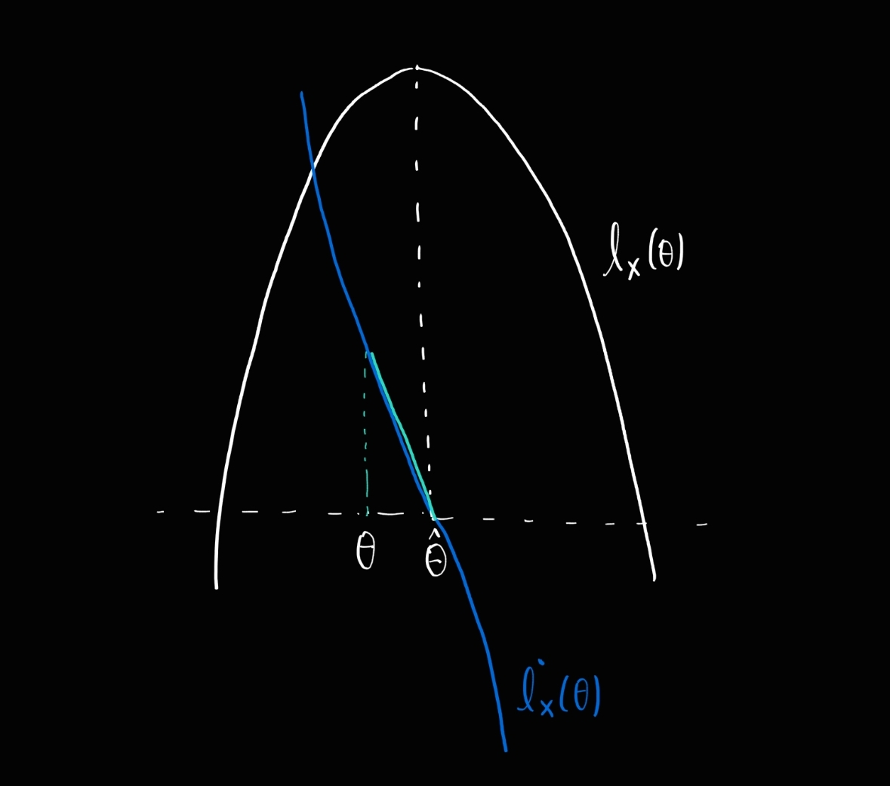
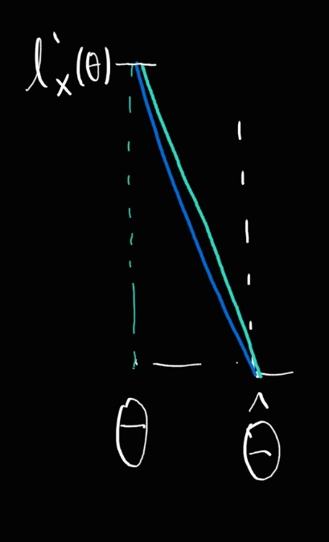
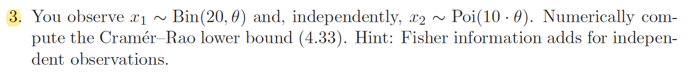

```{r setup, include=FALSE}
knitr::opts_chunk$set(echo = TRUE)
```

<br>

### Exercise 4.2






Since loglikelihood $l_x(\theta)$ is typically concave, we can draw a schematic graph of $l_x(\theta)$ as a concave function of $\theta$ which has a maximum value at $\theta=\hat\theta^{MLE}$. Near $\hat\theta^{MLE}$, $\dot{l}_x(\theta)$ has positive value at $\theta<\hat\theta^{MLE}$, negaive value at $\theta>\hat\theta^{MLE}$, and zero value at $\theta=\hat\theta^{MLE}$ as drawn in the first figure. Now, from the second figure, we can justify (4.25) $$\hat\theta^{MLE}\dot{=}\;\theta+\frac{\dot {l}_x(\theta)}{-\ddot{l}_x(\theta)} $$
The slope of $\dot{l}_x(\theta)$ is $\ddot{l}_x(\theta)$, which can be approximated by $$\ddot{l}_x(\theta)\dot{=}\;\frac{\dot{l}_x(\theta)}{\theta-\hat\theta^{MLE}} \quad \because \; \dot{l}_x(\hat\theta^{MLE})=0$$
By multiplying $\theta-\hat\theta^{MLE}$  and dividing by $\ddot{l}_x(\theta)$ on both sides, we get the desired result.

<br>

### Exercise 4.3



let $x=(x_1, x_2)$ . $$I(\theta)=E\Big[\big(\frac{\partial}{\partial\theta}\log f(x;\theta)\big)^2 \Big]=-E\Big[\frac{\partial^2}{\partial\theta^2}\log f(x;\theta) \Big]=-E\Big[\frac{\partial^2}{\partial\theta^2}\log f(x_1;\theta) \Big]-E\Big[\frac{\partial^2}{\partial\theta^2}\log f(x_2;\theta) \Big] \quad \because\; x_1, x_2\quad indep.$$

We can analytically derive a closed form of $I(\theta)$ and Cramer-Rao lower bound which is $I(\theta)^{-1}$

$$ 
\begin{aligned}
  f(x_1;\theta)&=\binom{20}{x_1}\theta^{x_1}(1-\theta)^{20-x_1} \\
  \log f(x_1;\theta)&= \log\binom{20}{x_1}+x_1\log\theta+(20-x_1)\log(1-\theta) \\
  \frac{\partial}{\partial\theta}\log f(x_1;\theta)&=\frac{x_1}{\theta}-\frac{20-x_1}{1-\theta} \\
  \frac{\partial^2}{\partial\theta^2}\log f(x_1;\theta)&=-\frac{x_1}{\theta^2}-\frac{20-x_1}{(1-\theta)^2} \\
  -E\Big[\frac{\partial^2}{\partial\theta^2}\log f(x_1;\theta) \Big]&=\frac{20\theta}{\theta^2}+\frac{20(1-\theta)}{(1-\theta)^2}=\frac{20}{\theta(1-\theta)}\\
  f(x_2;\theta)&=\frac{e^{-10\theta}(10\theta)^{x_2}}{x_2!} \\
  \log  f(x_2;\theta)&= -10\theta+x_2\log(10\theta)-\log x_2! \\
  \frac{\partial}{\partial\theta}\log  f(x_2;\theta)&=-10 +\frac{x_2}{\theta} \\
  \frac{\partial^2}{\partial\theta^2}\log  f(x_2;\theta)&=-\frac{x_2}{\theta^2}\\
  -E\Big[\frac{\partial^2}{\partial\theta^2}\log f(x_1;\theta) \Big]&=\frac{10\theta}{\theta^2}=\frac{10}{\theta}
\end{aligned}
$$
Hence we have 
$$
\begin{aligned}
  I(\theta)&= \frac{20}{\theta(1-\theta)}+\frac{10}{\theta}=\frac{10(3-\theta)}{\theta(1-\theta)} \\ 
  CRLB(\theta)&=\frac{1}{I(\theta)}=\frac{\theta(1-\theta)}{10(3-\theta)} 
\end{aligned}
$$

Now we have to numerically compute CRLB given observed data $x_1$ and $x_2$. We shall find $\hat\theta^{MLE}$ and then CRLB can be computed as $CRLB(\hat\theta^{MLE})$ or $1/I(x)$ where 
$$
I(x)= -\frac{\partial^2}{\partial\theta^2}\log  f(x;\theta) \Big|_{\theta=\hat\theta^{MLE}} =-\Big(-\frac{x_1}{\theta^2}-\frac{20-x_1}{(1-\theta)^2}-\frac{x_2}{\theta^2}\Big)\;\Big|_{\theta=\hat\theta^{MLE}}=\frac{x_1+x_2}{\theta^2}+\frac{20-x_1}{(1-\theta)^2}\;\Big |_{\theta=\hat\theta^{MLE}}
$$ 
is an observed Fisher information.  
We shall now consider an algorithm to find $\hat\theta^{MLE}$ numerically.
$$
\begin{aligned}
  \dot{l}_x(\theta)&=\frac{x_1}{\theta}-\frac{20-x_1}{1-\theta}-10 +\frac{x_2}{\theta}=\frac{x_1+x_2}{\theta}-\frac{20-x_1}{1-\theta}-10 \\
  \ddot{l}_x(\theta)&=-\frac{x_1+x_2}{\theta^2}-\frac{20-x_1}{(1-\theta)^2}<0\quad \;\forall\;0<\theta<1 \\
  \dot{l}_x(\theta)&=0 \Leftrightarrow (1-\theta)(x_1+x_2)-\theta(20-x_1)-10\theta(1-\theta)=0\Leftrightarrow 10\theta^2-(30+x_2)\theta+(x_1+x_2)=0
\end{aligned}  
$$
Define a function $g$ by 
$$
g(\theta)=10\theta^2-(30+x_2)\theta+(x_1+x_2)=10\Big(\theta-\frac{30+x_2}{20} \Big)^2+constant
$$

Note that $\dot{l}_x(\theta)=0\Leftrightarrow g(\theta)=0$ on $\theta\in (0,1)$. Hence, if we can find a solution $\theta\in(0,1)$ of $g(\theta)=0$, then it is a solution of likelihood equation so that it is $\hat\theta^{MLE}$. Note that since $\frac{30+x_2}{20}>1.5$, by the shape of $g$, $g(\theta)=0$ must have a root bigger than 1.5 , which implies that we should guide the algorithm to do not find a solution outside of desired area $(0,1)$.  
Here we can show an algorithm to find $\hat\theta^{MLE}$. To generate a sample $x_1, x_2$, we set a true value of $\theta$ as $0.7$. To find a solution $\theta$ in $(0,1)$, we shall use Newton's method with an initial value $$\hat\theta^{MME}=\frac{x_1+2x_2}{40} \quad\; \because \; \theta=E\big[\frac{X_1}{20}\big],\; \theta=E\big[\frac{X_2}{10}\big]\Rightarrow 2\theta=E\big[\frac{X_1}{20}+\frac{X_2}{10}\big] $$

```{r}

theta=0.7

set.seed(100)
x1=rbinom(1, size=20, prob=theta)
x2=rpois(1, lambda=10*theta)
print(c(x1, x2))

```
```{r}
# error tolerance value for terminating the alogirthm
tol=1e-8

# function g defined above
g=function(theta, x1, x2){
  10*theta^2-(30+x2)*theta+(x1+x2)
}
# derivative of g with respect to  theta
gprime=function(theta, x1, x2){
  20*theta-(30+x2)
}

# find mle given data and error tolerance
# 'mix' stands for 
binompois_mle<-function(x1,x2, tol){
  # initial value is theta.mme
  theta.current=(x1+2*x2)/40
  while(TRUE){
    # update theta value by newton's method
    theta.new = theta.current - g(theta.current, x1,x2) / gprime(theta.current, x1,x2)
    
    # break the iteration if |g(theta)| < error tolerance
    if(abs(g(theta.new,x1,x2))<tol ) break
    
    # If theta deviates from (0,1) then end the iteration and print the message
    if(theta.new > 1 | theta.new < 0) {
      print("out of parameter sapce (0,1)")
      break
    }
    theta.current = theta.new
  }
  return(theta.new)
}

theta.hat=binompois_mle(x1, x2, tol)
theta.hat
```

Given $\theta=0.7$, the sample $x_1=15, \, x_2=5$ is generated. From this sample, we calculate $\hat\theta^{MLE}=0.71922$ which is quite close to the true value of $\theta$.
```{r}
CRLB.true=theta*(1-theta)/(10*(3-theta))
CRLB.plugin=theta.hat*(1-theta.hat)/(10*(3-theta.hat))
obsinfo=(x1+x2)/theta.hat^2+(20-x1)/(1-theta.hat)^2
CRLB.obsinfo=1/obsinfo
print(cbind(CRLB.true, CRLB.plugin, CRLB.obsinfo))
```

`CRLB.plugin` equals to $CRLB(\hat\theta^{MLE})$ and `CRLB.obsinfo` equals to $1/I(x)$ We can check that `RCLB.plugin` and `RCLB.obsinfo`, which are the resulted computation for RCLB by our numerical method, are pretty close to the true value of Cramer Rao lower bound.

### Problem 2


We shall generate random $n$ samples from $Cauchy(0,1)$ distribution for 10000 times. Each time we will find MLE of $\theta$ which is a location parameter of cauchy distribution. (Note that the true value is set as $0$). True value of CRLB is $1/I(\theta)$ where 
$$ 
\begin{aligned}
  f(x_1;\theta)&=\frac{1}{\pi}\frac{1}{1+(x_1-\theta)^2} \\
  \log f(x_1;\theta)&= -\log\pi -\log\{1+(x_1-\theta)^2 \} \\
  \frac{\partial}{\partial\theta}\log f(x_1;\theta)&=\frac{2(x_1-\theta)}{1+(x_1-\theta)^2} \\
  \frac{\partial^2}{\partial\theta^2}\log f(x_1;\theta)&=\frac{2\{(x_1-\theta)^2-1\}}{\{1+(x_1-\theta)^2\}^2}   \\
  I_1(\theta)&=-E\Big[\frac{\partial^2}{\partial\theta^2}\log f(x_1;\theta) \Big]= \frac{1}{2} \\
  I(\theta)&=-E\Big[\frac{\partial^2}{\partial\theta^2}\log f(x;\theta) \Big]=\sum_{i=1}^n -E\Big[\frac{\partial^2}{\partial\theta^2}\log f(x_i;\theta)\Big]=n\cdot\frac{1}{2}
\end{aligned}
$$
Thus, we have the true value of CRLB (asymptotic variance of MLE) given by 
$$
CRLB(\theta)=\frac{1}{n\cdot \frac{1}{2}}=\frac{2}{n} 
$$
Note that $CRLB(\hat\theta^{MLE})=CRLB(\theta)\;\Big|_{\theta=\hat\theta^{MLE}}$ is independent of observed data $x$ in this case because $CRLB(\theta)$ is constant. Fisher suggested the observed information bound $1/I(x)$ as an estimate for asymptotic variance of MLE, which is given as
$$
I(x)= \sum_{i=1}^n -\frac{\partial^2}{\partial\theta^2}\log f(x_i;\theta) \;\Bigg|_{\theta=\hat\theta^{MLE}}=\sum_{i=1}^n\frac{2\{1-(x_i-\theta)^2\}}{\{1+(x_i-\theta)^2\}^2} \;\Bigg|_{\theta=\hat\theta^{MLE}} 
$$
Unlike plug in estimate of CRLB, the observed information bound $1/I(x)$ depends on the observed data $x$ .  
Now, we shall generate a list of MLE's and the observed information bounds corresponding to 10000 times of randomly generated data samples of size $n$. 
```{r}
# l'(theta) where l(theta) is loglikelihood function
cauchy_lprime<-function(theta, x){
  n=length(x)
  sum=0
  for(i in 1:n){
    numerator=2*(x[i]-theta)
    denominator=1+(x[i]-theta)^2
    sum = sum + numerator/denominator
  }
  return(sum)
}

# l''(theta) where l(theta) is loglikelihood function
cauchy_ldprime<-function(theta,x){
  n=length(x)
  sum=0
  for(i in 1:n){
    numerator = 2*((x[i]-theta)^2-1)
    denominator = (1+(x[i]-theta)^2)^2
    sum = sum + numerator/denominator
  }
  return(sum)
}

# Function to find mle using Newton's method
cauchy_mle<-function(x, tol){
  # Use initial value as median since location parameter of cauchy distribution is population median
  theta.current=median(x)
  iter=0
  while(TRUE){
    theta.new = theta.current - cauchy_lprime(theta.current, x) / cauchy_ldprime(theta.current, x)
    if(abs(cauchy_lprime(theta.new,x))<tol ) break
    theta.current = theta.new
    iter=iter+1
    # Print a message if the algorithm converges too slow
    if(iter>1e+5) {
      print('too slow for iteration to converge')
      break
    }
  }
  return(theta.new)
}

# Function to calculate observed information bound
cauchy_obs_info_bound<-function(x){
  n=length(x)
  obs_info = - cauchy_ldprime(cauchy_mle(x, tol), x)
  return(1/obs_info)
}
```

To find MLE, we need to find a solution of likelihood equation. First, we have tried to use Newton's method.
```{r}
# We will generate 10000 datasets.
N=10000

# List of MLEs and observed Information bounds will be stored in X
X=matrix(0, ncol=2, nrow=N)
colnames(X)<-c('MLE', 'Obs.Info.Bound')

# sample size
n=20

#error tolerance
tol=1e-6

set.seed(100)

for(i in 1:N){
  # Generate sample of size n from cauchy(0,1)
  x=rcauchy(n, location=0, scale=1)
  mle = cauchy_mle(x, tol)
  # Too large value of theta may be a wrong answer
  if(abs(mle)>1e+03) {
    print("Abnormal value of mle is yielded")
    # Draw another sample and find mle again
    while(abs(mle)>1e+03){
      x=rcauchy(n, location=0, scale=1)
      mle=cauchy_mle(x, tol)
    }
  }
  # Calculate observed information bound
  obs_info_bound = cauchy_obs_info_bound(x)
  X[i,]=c(mle, obs_info_bound)
}

X=as.data.frame(X)
# Sorting the list by the order statistics of observed information bound
X=X[order(X$Obs.Info.Bound),]
head(X, 10)

```

We can see that performance of Newton's method for finding MLE is not quite good in this case.  
- Since we know the true value of $\theta$, we can say that too large $\hat\theta$ value is abnormal to estimate $\theta$. Probably what the algorithm found is local maximizer of $\dot l_x(\theta)$ other than $\hat\theta^{MLE}$.  
- For some sample data, the algorithm does not converge even after 100000 iterations. It is too slow.  
As an alternative, we shall use Dekker's method which is a hybrid method combining a bisection method with a secant method.

```{r}
# To use a function `swap`
library(seqinr)

cauchy_mle<-function(x, tol){
  # Start an algorithm with initial interval [a,b]
  # Here [a,b] is chosen as [-k, k] where k=|med(X_i)|+3
  # For bisection method to begin, l'(a)l'(b) < 0 should be satisfied.
  a = -(abs(median(x))+3)
  theta.past = a
  theta.current=abs(median(x))+3
  iter=0
  while(cauchy_lprime(theta.past, x)*cauchy_lprime(theta.current, x ) > 0){
    # If bisection l'(a)l'(b) < 0 is not satisfied then 
    # give small fluctuation to a and b to attain the condition
    warning("the initial values does not saitsfy starting condition 
    of bisection method. Shifting it a little...")
    theta.past = theta.past + rnorm(1)
    theta.current =  theta.current + rnorm(1)
    a=theta.past
    # If this procedure takes too much iteration, return NA 
    iter=iter+1
    if(iter>1e+3) {
      print('initial value shifing is too complicated')
      return(NA)
      break
    }
  }
  iter=0
  while(TRUE){
    # Calculate the ratio which is used instead of l''(theta)
    # This is a difference between Newton's method and secant method
    ratio = (cauchy_lprime(theta.current, x)-cauchy_lprime(theta.past, x)) / (theta.current-theta.past)
    
    # For current bisection interval [a,b], calculate middle point m
    middle=(a + theta.current)/2
    
    # Propose a updated theta value , which is mainly done by a secant method
    # If two previous theta value are the same, then secant method cannot be used 
    # so that middle point is proposed as new theta.
    proposal = ifelse(cauchy_lprime(theta.current, x)-cauchy_lprime(theta.past, x) !=0 ,
                      theta.current-cauchy_lprime(theta.current, x) / ratio, middle)
    
    # Determine an updated theta. Proposed theta becomes updated theta if it lies between m and b
    # Other wise, middle point becomes an updated theta
    if(middle<theta.current){
      theta.new=ifelse(proposal<=theta.current & proposal>=middle, proposal, middle)
    }
    else{
      theta.new=ifelse(proposal<=middle & proposal>=theta.current, proposal, middle)
    }
    
    # End the iteration if " |l'(theta)| < error tolerance "  is attained.
    if(abs(cauchy_lprime(theta.new,x))<tol ) break
    
    # Setting a bisection interval [a,b] for the next step
    if(cauchy_lprime(theta.new, x)*cauchy_lprime(a, x) > 0) a=theta.current
    if(abs(cauchy_lprime(theta.new,x)) > abs(cauchy_lprime(a, x)) ) swap(a, theta.new)
    
    theta.past=theta.current
    theta.current=theta.new
    
    # Print a message if the algorithm converges too slow
    iter=iter+1
    if(iter>1e+5) {
      print('too slow for iteration to converge')
      break
    }
    
  }
  return(theta.new)
}

# We will generate 10000 datasets.
N=10000

# List of MLEs and observed Information bounds will be stored in X
X=matrix(0, ncol=2, nrow=N)
colnames(X)<-c('MLE', 'Obs.Info.Bound')

# sample size
n=20

#error tolerance
tol=1e-6

set.seed(100)

for(i in 1:N){
  # Generate sample of size n from cauchy(0,1)
  x=rcauchy(n, location=0, scale=1)
  mle = cauchy_mle(x, tol)
  # Too large value of theta may be a wrong answer
  if(abs(mle)>1e+03) {
    print("Abnormal value of mle is yielded")
    # Draw another sample and find mle again
    while(abs(mle)>1e+03){
      x=rcauchy(n, location=0, scale=1)
      mle=cauchy_mle(x, tol)
    }
  }
  # Calculate observed information bound
  obs_info_bound = cauchy_obs_info_bound(x)
  X[i,]=c(mle, obs_info_bound)
}

X=as.data.frame(X)
# Sorting the list by the order statistics of observed information bound
X=X[order(X$Obs.Info.Bound),]
head(X, 10)

```
Thanks to Dekker's method, the problems we had when we used Newton's method are solved. We can guess that this is because we start the algorithm in restricted interval which $\hat\theta^{MLE}$ is most likely to lie in.  
Now it is time to recreate Figure 4.2
```{r}
# Create a function which splits the list of MLE's and observed information bounds
# by the size of observation information bounds
# and then calculate variance of MLE & median of observed information bounds in each group
splitter<-function(X){
  percent=c(0,5,15,25,35,45,55,65,75,85,95,100)
  N=nrow(X)
  last.indices=N*percent/100
  var_theta=rep(0, 11)
  med_infobound=rep(0,11)
  for(i in 2:12){
    indices=(last.indices[i-1]+1):last.indices[i]
    thetas=X[indices, 1]
    infobounds=X[indices,2]
    var_theta[i-1]=var(thetas)
    med_infobound[i-1]=median(infobounds)
  }
  as.data.frame(cbind(var_theta, med_infobound))
}

S=splitter(X)

# Recreate Figure 4.2 with n = 20
plot(S$med_infobound, S$var_theta, col='blue', pch=20, 
     xlab='Observed Information Bound', ylab='MLE variance', main='Reproducing Figure 4.2 with n=20',
     ylim=c(0,round(max(S$var_theta),2))
     )

# CRLB(theta) which does not depend on the data 
unconditional.variance= 1/ (1/2 * n)
abline(h=unconditional.variance, lty='dotted', col='red')

# linear regression fit of Var(theta) ~ Med(Obs.Info.Bound) 
fit<-lm(var_theta~med_infobound, data=S)
abline(fit$coefficients, lty='dotted')


```  

Repeat this procedure for $n=100$ case.
```{r}
# We will generate 10000 datasets.
N=10000

# List of MLEs and observed Information bounds will be stored in X
X=matrix(0, ncol=2, nrow=N)
colnames(X)<-c('MLE', 'Obs.Info.Bound')

# sample size
n=100

#error tolerance
tol=1e-6

set.seed(100)

for(i in 1:N){
  # Generate sample of size n from cauchy(0,1)
  x=rcauchy(n, location=0, scale=1)
  mle = cauchy_mle(x, tol)
  # Too large value of theta may be a wrong answer
  if(abs(mle)>1e+03) {
    print("Abnormal value of mle is yielded")
    # Draw another sample and find mle again
    while(abs(mle)>1e+03){
      x=rcauchy(n, location=0, scale=1)
      mle=cauchy_mle(x, tol)
    }
  }
  # Calculate observed information bound
  obs_info_bound = cauchy_obs_info_bound(x)
  X[i,]=c(mle, obs_info_bound)
}

X=as.data.frame(X)
# Sorting the list by the order statistics of observed information bound
X=X[order(X$Obs.Info.Bound),]
head(X, 10)

S=splitter(X)

# Recreate Figure 4.2 with n = 20
plot(S$med_infobound, S$var_theta, col='blue', pch=20, 
     xlab='Observed Information Bound', ylab='MLE variance', main='Reproducing Figure 4.2 with n=100',
     ylim=c(0,round(max(S$var_theta),2))
     )

# CRLB(theta) which does not depend on the data 
unconditional.variance= 1/ (1/2 * n)
abline(h=unconditional.variance, lty='dotted', col='red')

# linear regression fit of  Var(theta) ~ Med(Obs.Info.Bound)
fit<-lm(var_theta~med_infobound, data=S)
abline(fit$coefficients, lty='dotted')

```  


