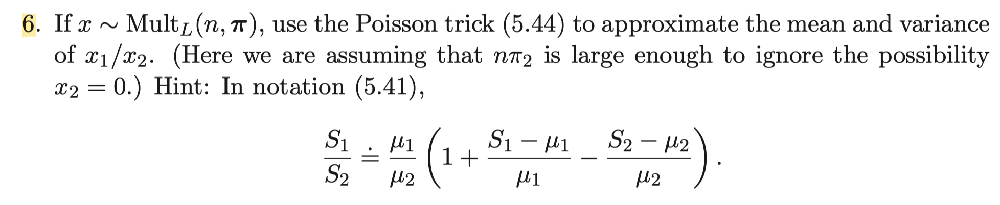
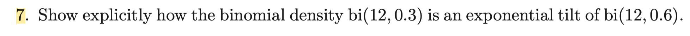

```{r setup, include=FALSE}
knitr::opts_chunk$set(echo = TRUE)
```

### Exercise 5.6
  
The Posson trick of (5.44) in textbook tells us that  
$$
\text{If}\;\, N\sim Poi(n)\;\,\text{and}\;\, \mathbf{X}|N\sim Multi_{L}(N, \mathbf{\pi}) \;\,\text{then}\;\, \mathbf{X}\sim Poi(n\mathbf{\pi})
$$
where $\mathbf{X}=(X_1, \cdots X_L)$ and $\mathbf{X}\sim Poi(n\mathbf{\pi})$ means $X_1, \cdots, X_L$ are independent Poisson random variables having possibly different parameters $X_j\overset{ind}{\sim} Poi(n\pi_j)\;\,\forall\, j=1,\cdots, L\;$. By using this trick, if $\mathbf{X}\sim Multi_L(n, \mathbf{\pi})$ then $X_1\dot{\,\sim} \,Poi(n\pi_1),\; X_2\dot{\,\sim} \,Poi(n\pi_2)\; \text{independently}$.  
Here, we shall use the hint. THe hint is derived from linear approximation of the function $(x,y)\mapsto x/y$  
$$
\text{Let}\;\,g:\mathbb{R}\times (\mathbb{R} -\{0\})\rightarrow \mathbb{R}\,\;\text{be given by}\,\; g(x,y)=x/y 
$$
$$
\begin{aligned}
g(x,y)&\approx g(x_0, y_0)+\nabla g(x_0, y_0)\cdot (x-x_0,\, y-y_0) \\
    &= \frac{x_0}{y_0}+\frac{1}{y}(x-x_0)-\frac{x_0}{y_0^2}(y-y_0) = \frac{x_0}{y_0}\big\{1+\frac{x-x_0}{x_0}-\frac{y-y_0}{y_0} \big\}
\end{aligned}
$$
Therefore, using the hint for $X_1$ and $X_2$ in our problem, we have
$$
\frac{X_1}{X_2}\approx \frac{n\pi_1}{n\pi_2}\big\{1+\frac{X_1-n\pi_1}{n\pi_1}-\frac{X_2-n\pi_2}{n\pi_2} =\frac{\pi_1}{\pi_2}\big\{1+\frac{X_1-n\pi_1}{n\pi_1}-\frac{X_2-n\pi_2}{n\pi_2}\big\}
$$
Taking expectation, we have
$$
E\big[\frac{X_1}{X_2}\big]\approx \frac{\pi_1}{\pi_2}(1+0+0)=\frac{\pi_1}{\pi_2}
$$
Now, taking variance with considering independence, we have
$$
Var\big[\frac{X_1}{X_2}\big]\approx \big(\frac{\pi_1}{\pi_2}\big)^2\big\{Var(\frac{X_1-n\pi_1}{n\pi_1})+Var(\frac{X_2-n\pi_2}{n\pi_2})\big\}=\big(\frac{\pi_1}{\pi_2}\big)^2\big\{\big(\frac{1}{n\pi_1}\big)^2 n\pi_1+ \big(\frac{1}{n\pi_2}\big)^2 n\pi_2\big\}=\frac{1}{n}\big(\frac{\pi_1}{\pi_2}\big)^2\big(\frac{1}{\pi_1}+\frac{1}{\pi_2}\big)
$$  

### Exercise 5.7

For given $n$, pdf of $B(n, p)$ is expressed as $f_p(x)=\binom{n}{x}p^x(1-p)^{n-x}=\binom{n}{x}\exp\{x\log p+(n-x)\log(1-p)\}$  
Hence, for any $p$ and $p_0$ with fixed $n$ , we have the ratio of binomial densities at two parameter values $p$ and $p_o$ as
$$
\begin{aligned}
    \frac{f_p(x)}{f_{p_0}(x)}&=\frac{\exp\{x\log p+(n-x)\log(1-p)\}}{\exp\{x\log p_0+(n-x)\log(1-p_0)\}}=\exp\big\{x\log\frac{p}{p_0}+(n-x)\log\frac{1-p}{1-p_0} \big\} \\
    &= exp\big\{x\big(\log\frac{p}{1-p}-\log\frac{p_0}{1-p_0} \big)+n\log\frac{1-p}{1-p_0} \big\}
\end{aligned}
$$

Now, we shall plug in $n=12$, $p=0.3$ and $p_0=0.6$ on above.
$$
f_{p}(x)=\exp\{x(\,\log(0.3/0.7)-\log(0.6/0.4)\,)+12\cdot \log(0.7/0.4)\}f_{p_0}(x)= c\cdot\exp(-1.253x)f_{p_0}(x)
$$
where $c=(0.4/0.7)^{12}$ is normalizing constant.  
Hence, binomial density $B(12, 0.3)$ is an exponential tilt of $B(12, 0.6)$ with the exponential factor $\exp(-1.253x)$