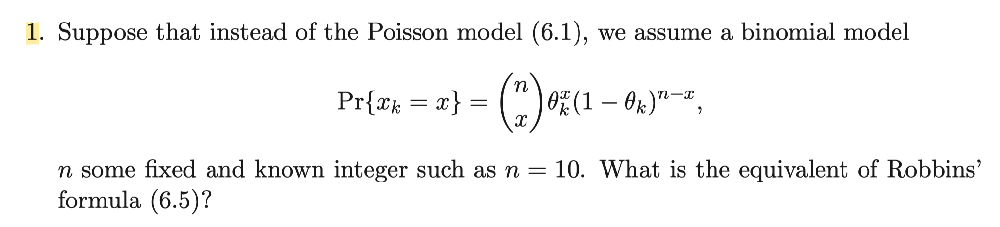
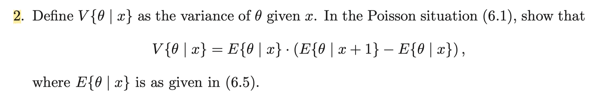
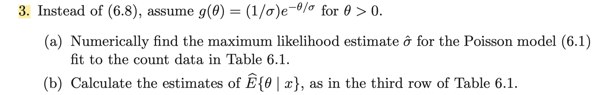
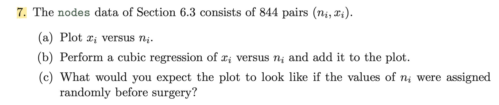

```{r setup, include=FALSE}
knitr::opts_chunk$set(echo = TRUE)
```

### Exercise 6.1

$$
\begin{aligned}
E[\theta|x]&=\frac{\int _0^\infty \theta p_\theta(x)g(\theta)\,d\theta}{\int_0^\infty p_\theta(x)g(\theta)\,d\theta} \\
f(x)&=\int_0^\infty p_\theta(x)g(\theta)\,d\theta \\
\text{Robbin's Formula}&\quad E[\theta|x]=\frac{(x+1)f(x+1)}{f(x)}
\end{aligned}
$$
Robbin's Formula comes out from the model $X|\theta\sim Poi(\theta)$  
Now, assume a new model $X|\theta\sim B(n, \theta)$ with $n=10$ 
$$
E[\theta|x]=\frac{\int _0^1 \theta p_\theta(x)g(\theta)\,d\theta}{\int_0^1 p_\theta(x)g(\theta)\,d\theta} 
$$
$$
f(x)=\int_0^1 p_\theta(x)g(\theta)\,d\theta = \int_0^1 \binom{10}{x}\theta^x(1-\theta)^{10-x}g(\theta)\,d\theta
$$
$$
\begin{aligned} 
\int _0^1 \theta p_\theta(x)g(\theta)\,d\theta &= \int_0^1 \binom{10}{x}\theta^{x+1}(1-\theta)^{10-x}g(\theta)\,d\theta \\ &=\int_0^1 \binom{10}{x}\theta^{x+1}(1-\theta)^{10-(x+1)}(1-\theta)g(\theta)\,d\theta \\
&=\int_0^1 \binom{10}{x}\theta^{x+1}(1-\theta)^{10-(x+1)}g(\theta)\,d\theta-\int_0^1 \binom{10}{x}\theta^{x+2}(1-\theta)^{10-(x+1)}g(\theta)\,d\theta \\
&=\frac{\binom{10}{x}}{\binom{10}{x+1}}f(x+1)-\int_0^1 \binom{10}{x}\theta^{x+2}(1-\theta)^{10-(x+2)}(1-\theta)g(\theta)\,d\theta \\
&=\frac{\binom{10}{x}}{\binom{10}{x+1}}f(x+1)-\frac{\binom{10}{x}}{\binom{10}{x+2}}f(x+2)+\int_0^1 \binom{10}{x}\theta^{x+3}(1-\theta)^{10-(x+2)}g(\theta)\,d\theta \\
&= \cdots
\end{aligned}
$$
The last term of above will be given by
$$
\pm \int_0^1 \binom{10}{x}\theta^{10}(1-\theta)^1g(\theta)\,d\theta=\pm \frac{\binom{10}{x}}{\binom{10}{10}}\int_0^1 \binom{10}{10}\theta^{10}g(\theta)\,d\theta \;\mp \binom{10}{x}\int_0^1\theta^{11}g(\theta)\,d\theta
$$
Here, we can say that
$$
\binom{10}{x}\int_0^1\theta^{11}g(\theta)\,d\theta= \frac{\binom{10}{x}}{\binom{11}{11}}\int_0^1 \binom{11}{11}\theta^{11}g(\theta)\,d\theta \approx \binom{10}{x}f(11)=0
$$
Since $x\in \{1,\cdots,n=10\}$ , we can say $f(11)=0$  
Therefore, 

$$
\begin{aligned}
\int _0^1 \theta p_\theta(x)g(\theta)\,d\theta &=\frac{\binom{10}{x}}{\binom{10}{x+1}}f(x+1)-\frac{\binom{10}{x}}{\binom{10}{x+2}}f(x+2)+\cdots \pm \binom{10}{x} f(10) \\ &= \sum_{k=1}^{10-x}(-1)^{k-1} \frac{\binom{10}{x}}{\binom{10}{x+k}}f(x+k)
\end{aligned}
$$

$$
\begin{aligned}
E[\theta|x]&=\frac{\int _0^1 \theta p_\theta(x)g(\theta)\,d\theta}{\int_0^1 p_\theta(x)g(\theta)\,d\theta} \\
&=\frac{\sum_{k=1}^{10-x}(-1)^{k-1} \frac{\binom{10}{x}}{\binom{10}{x+k}}f(x+k)}{f(x)}
\end{aligned}
$$
This is the equivalent of Robbin's formula for binomial model.


### Exercise 6.2

By the definition of conditional variance, 
$$
V(\theta|x)=E[\theta^2|x]-E[\theta|x]^2
$$
By Robbin's formula,
$$
E[\theta|x]=\frac{(x+1)f(x+1)}{f(x)}
$$
Similarly, 
$$
\begin{aligned}
E[\theta^2|x]&=\frac{\int _0^\infty \theta^2 p_\theta(x)g(\theta)\,d\theta}{\int_0^\infty p_\theta(x)g(\theta)\,d\theta} \\
\int_0^\infty \theta^2p_\theta(x)g(\theta)\,d\theta&= \int_0^\infty \frac{e^{-\theta}\theta^{x+2}}{x!} \;g(\theta)\,d\theta = (x+1)(x+2)f(x+2) \\
&\Rightarrow \; E[\theta^2|x]=\frac{(x+1)(x+2)f(x+2)}{f(x)}
\end{aligned}
$$

$$
E[\theta|x]\cdot E[\theta|x+1]= \frac{(x+1)f(x+1)}{f(x)}\frac{(x+2)f(x+2)}{f(x+1)}=\frac{(x+1)(x+2)f(x+2)}{f(x)}=E[\theta^2|x]
$$
Therefore, 
$$
V(\theta|x)=E[\theta^2|x]-E[\theta|x]^2 = E[\theta|x]\cdot E[\theta|x+1]-E[\theta|x]^2=E[\theta|x]\cdot(E[\theta|x+1]-E[\theta|x])
$$

### Exercise 6.3


#### 6.3-(a)
Assume the model below :
$$
\theta\sim Exp(\sigma)\quad \quad x|\theta \sim Poi(\theta)
$$
We will derive the marginal distribution of $x$ given $\sigma$
$$
\begin{aligned}
  g_\sigma(\theta)&=\frac{1}{\sigma}\exp(-\frac{\theta}{\sigma}) \\
  p(x|\theta)&=\frac{\exp(-\theta)\theta^x}{x!} \\
  g_\sigma(\theta)p(x|\theta)&=\frac{1}{\sigma}\frac{1}{x!}\theta^x\exp(-\frac{\theta}{\gamma}) \quad \text{where}\quad \gamma=\frac{\sigma}{\sigma+1} \quad\text{and}\quad \sigma=\frac{\gamma}{1-\gamma} \\
  f_\sigma(x)&=\int_0^\infty g_\sigma(\theta)p(x|\theta)= \frac{1}{\sigma}\frac{1}{x!}\int_0^\infty\theta^x\exp(-\frac{\theta}{\gamma}) \,d\theta\\ 
  &=\frac{1}{\sigma}\frac{1}{x!}\Gamma(x+1)\gamma^{x+1}=\frac{1}{\sigma}\gamma^{x+1}=\frac{1-\gamma}{\gamma}\gamma^{x+1}
\end{aligned}
$$
We can label $f_\sigma(x)$ by $f_\gamma(x)$ since $\sigma\mapsto \gamma$ is one to one transform.
To get MLE of $\sigma$, we shall yield MLE of $\gamma$ and then take inverse transform.
$$
\begin{aligned}
\text{loglikelihood}& =\sum_{i=1}^{N}\log f_\gamma(x)=\sum_{x=0}^{x_{max}}y_x\log f_\gamma(x)  \\
\hat\gamma &=\text{argmax}_\gamma \sum_{x=0}^{x_{max}}y_x\log f_\gamma(x) \\
\log f_\gamma(x)&=\log\frac{1-\gamma}{\gamma}+(x+1)\log\gamma \\
\frac{\partial}{\partial\gamma}\log f_\gamma(x)&=-\frac{1}{\gamma(1-\gamma)}+\frac{x+1}{\gamma} \\
\frac{\partial^2}{\partial\gamma^2}\log f_\gamma(x)&=\frac{1-2\gamma}{(1-\gamma)^2\gamma^2}-\frac{x+1}{\gamma^2} = \frac{1}{\gamma^2}-\frac{1}{(1-\gamma)^2}-\frac{x}{\gamma^2}-\frac{1}{\gamma^2}\\ &=-\frac{1}{(1-\gamma)^2}-\frac{x}{\gamma^2}<0
\end{aligned}
$$
Note that by the last inequality, loglikelihood function is strictly concave, which makes it easy to find MLE.  

```{r}
x=c(0,1,2,3,4,5,6,7)
y=c(7840, 1317, 239, 42, 14, 4, 4, 1)
claim=as.data.frame(cbind(x,y))
claim

```
Here we reproduce the table 6.1 in the textbook. Now we shall make a R function calculating loglikelihood and derivative of loglikelihood.
```{r}
# loglikelihood as a function of gamma
logf<-function(gamma){
  z=c(0)
  for(i in 1:length(x)){
    z[i]=log((1-gamma)/gamma)+(x[i]+1)*log(gamma)
  }
  return(sum(z*y))
}

# derivative of loglikelihood as a function of gamma
logfp<-function(gamma){
  z=c(0)
  for(i in 1:length(x)){
    z[i]=-1/(gamma*(1-gamma))+(x[i]+1)/gamma
  }
  return(sum(z*y))
}

```

To derive a MLE $\hat \gamma$, we need an initial value to start numerical algorithm.  
Since $\sigma>0$ and $\gamma=\frac{\sigma}{\sigma+1}$, we have $0<\gamma<1$.  
Also, since $E[x|\theta]=\theta$ and $E[x]=E[E[x|\theta]]=E[\theta]=\sigma$ , we can use $\overline{X}$ as an estimate of $\sigma$. Then, plugin estimator $\frac{\overline{X}}{\overline{X}+1}$ would be an initial value to start numerical algorithm to find $\hat\gamma$.
```{r}
N=sum(y)
samplemean=sum(x*y)/N
initialvalue=samplemean/(1+samplemean)
logfp(initialvalue)

```

Surprisingly, if we plug in $\gamma=\frac{\overline{X}}{\overline{X}+1}$ on $\frac{\partial}{\partial\gamma}\text{loglikelihood}$, we have nearly zero value (magnitude is an order of $10^{-12}$). Drawing loglikelihood as a function of gamma gives us a clear sight that this value is indeed an MLE of $\gamma$.

```{r}
gammas=seq(from=0, to=1, by=0.001)
loglikelihood=0
for(i in 1:length(gammas)){
  loglikelihood[i]=logf(gammas[i])
}
plot(gammas, loglikelihood, type='l', xlab=expression(gamma))
title(main="Loglikelihood as a function of gamma")
abline(v=initialvalue, col='red', lty='dotted')

```

The red dotted line indicates the $\gamma$ value equal to $\frac{\overline{X}}{\overline{X}+1}$ . Therefore, $\hat\gamma=\frac{\overline{X}}{\overline{X}+1}$ and $\hat\sigma=\overline{X}$
```{r}
(sigma_hat=samplemean)
```
As a result, we derive $\hat\sigma=0.2144$

#### 6.3-(b)
Using Robbin's formula, we will now calculate the estimates $\widehat E[\theta|x]$ as in the third row of table 6.1  
$$
\widehat E[\theta|x]=\frac{(x+1)f_{\hat \sigma}(x+1)}{f_{\hat\sigma}(x)} \\
f_\sigma(x)=\frac{1}{\sigma}\gamma^{x+1}=\frac{1}{\sigma}(\frac{\sigma}{\sigma+1})^{x+1}
$$
```{r}
f.sigma_hat<-function(x){
  (sigma_hat/(1+sigma_hat))^(x+1) /sigma_hat
}
# yield estimate of E[theta|x] using sigma_hat and Robbin's formula
Robbin<-function(x){
  (x+1)*f.sigma_hat(x+1)/f.sigma_hat(x)
}

# Reproduce table 6.1 with Gamma MLE replaced by Exponential MLE
Exp_MLE=rep(NaN, length(x))
for(i in 1:length(x)){
  Exp_MLE[i]=Robbin(x[i])
}
claim=cbind(claim, Exp_MLE)
claim
```

### Exercise 6.7



```{r}
nodes=read.table('https://web.stanford.edu/~hastie/CASI_files/DATA/nodes.txt', header=T)
plot(nodes$n,nodes$x, xlab='nodes removed', ylab='nodes found positive')
title(main="nodes found positive VS nodes removed")
```

```{r}
# Formula for cubic linear regression model
form= as.formula(paste("x ~ ",paste("I( n^", seq(from = 1, to = 3, by = 1), ")",collapse = "+")))
# Calculate beta coefficients for cubic linear regression model
cubic=lm(form, data=nodes)
# Fitted value for n_i's
fit=0
for(i in 1:70){
  fit[i]=sum(c(1, i, i^2, i^3)*cubic$coef)
}
plot(nodes$n,nodes$x, xlab='nodes removed', ylab='nodes found positive')
# Red line added to represent cubic regression 
lines(fit, col='red')
title(main="nodes found positive VS nodes removed with cubic regression")
```


#### 6.7-(c)

Notice that in the above plot, $n_i$ values are concentrated on small values of $n_i$'s, which are on $[0, 30]$. If the values of $n_i$ were assigned randomly before surgery then we can expect that $n_i$ values on the plot may be more scattered than the above. But it may not affect the shape of regression fit of $x_i$ versus $n_i$.


### Problem2

In the missing species problem, we assumed that
$$
x|\theta\sim Poi(\theta)\quad \quad \theta\sim \Gamma(\nu, \sigma)\quad \text{where}\quad \nu, \sigma>0
$$

We can derive marginal density of $x$ as below :
$$
\begin{aligned}
  g_{\nu,\sigma}(\theta)&=\frac{1}{\Gamma(\nu)\sigma^\nu}\theta^{\nu-1}\exp(-\frac{\theta}{\sigma}) \\
  p(x|\theta)&=\frac{\exp(-\theta)\theta^x}{x!} \\
  g_{\nu,\sigma}(\theta)p(x|\theta)&=\frac{1}{\Gamma(\nu)\sigma^\nu}\frac{1}{x!}\theta^{x+\nu-1}\exp(-\frac{\theta}{\gamma}) \quad \text{where}\quad \gamma=\frac{\sigma}{\sigma+1} \quad\text{and}\quad \sigma=\frac{\gamma}{1-\gamma} \\
  f_{\nu,\sigma}(x)&=\int_0^\infty g_{\nu,\sigma}(\theta)p(x|\theta)= \frac{1}{\Gamma(\nu)\sigma^\nu}\frac{1}{x!}\int_0^\infty\theta^{x+\nu-1}\exp(-\frac{\theta}{\gamma})\,d\theta \\ 
  &=\frac{1}{\Gamma(\nu)\sigma^\nu}\frac{1}{x!}\Gamma(x+\nu)\gamma^{x+\nu}=\frac{1}{\Gamma(\nu)}\frac{1}{x!}\Gamma(x+\nu)\big(\frac{1-\gamma}{\gamma}\big)^\nu\gamma^{x+\nu} \\
  &=\frac{\Gamma(x+\nu)}{\Gamma(\nu)x!}(1-\gamma)^{\nu}\gamma^{x}
\end{aligned}
$$
Note that $0<\gamma<1$ . Assuming $\nu$ is positive integer, we have
$$
f_{\nu,\sigma}(x)=\frac{\Gamma(x+\nu)}{\Gamma(\nu)x!}(1-\gamma)^{\nu}\gamma^{x}=\frac{(x+\nu-1)!}{(\nu-1)!x!}(1-\gamma)^{\nu}\gamma^{x}=\binom{x+\nu-1}{\nu-1}(1-\gamma)^\nu\gamma^x \quad\; x=0,1,\cdots
$$
which is the probability mass function of $NegBin(\nu, 1-\gamma)$ where $\nu$ is the number of successes, $x$ is the number of failures, and $1-\gamma$ is the probability of success.

### Problem 3

The problem is to show that 
$$
E(t) =e_1 \frac{1 - (1 + \gamma t)^{-\nu} }{ \gamma \nu }\quad \text{where}\quad \gamma=(1/\sigma+1)^{-1}
$$
Our model is given as
$$
x_k\sim Poi(\theta_k) \quad x_k(t)\sim Poi(\theta_k t) \quad \forall \, k=1, \cdots , S
$$
where $x_k$ and $x_k(t)$ are independent.
To use parametric Bayes, we assume gamma prior for $\theta\sim \Gamma(\nu, \sigma)$  
$E(t)$ is the expected number of new species after time $t$ and $e_x=E[y_x]$ where $y_x$ represents the number of species which is observed exactly $x$ times.
$$
\begin{aligned}
  E(t)&=\sum_{k=1}^S P(x_k=0, x_k(t)>0)=\sum_{k=1}^S \int_0^\infty P(x_k=0, x_k(t)>0 \,|\, \theta_k)g(\theta_k)\,d\theta_k \\
  &= \sum_{k=1}^S \int_0^\infty e^{-\theta_k}(1-e^{-\theta_k t})g(\theta_k)\,d\theta_k=S\int_0^\infty e^{-\theta}(1-e^{-\theta t})g(\theta)\,d\theta \\
  e_x&=E\Big[\sum_{k=1}^S I(x_k=x)\Big]=\sum_{k=1}^S P(x_k=x)=\sum_{k=1}^S \int_0^\infty P(x_k=x\,|\, \theta_k)g(\theta_k)\,d\theta_k \\
  &=\sum_{k=1}^S \int_0^\infty \frac{e^{-\theta_k}\theta_k^x}{x!}g(\theta_k)\,d\theta_k=S\int_0^\infty \frac{e^{-\theta}\theta^x}{x!}g(\theta) \, d\theta \\
  e_1&= S\int_0^\infty \theta e^{-\theta} g(\theta)\, d\theta
\end{aligned}
$$
$$
\frac{E(t)}{e_1}=\frac{S\int_0^\infty e^{-\theta}(1-e^{-\theta t})g(\theta)\,d\theta}{S\int_0^\infty \theta e^{-\theta} g(\theta)\, d\theta}=\frac{\int_0^\infty e^{-\theta}g(\theta)\,d\theta - \int_0^\infty e^{-\theta(1+t)}g(\theta)\,d\theta}{\int_0^\infty \theta e^{-\theta} g(\theta)\, d\theta}
$$
Now plug in 
$$
g(\theta)=g_{\nu,\sigma}(\theta)=\frac{1}{\Gamma(\nu)\sigma^\nu}\theta^{\nu-1}\exp(-\frac{\theta}{\sigma})
$$
Then
$$
\begin{aligned}
  \int_0^\infty e^{-\theta}g(\theta)\,d\theta &= \int_0^\infty\frac{1}{\Gamma(\nu)\sigma^\nu}\theta^{\nu-1}\exp(-\frac{\theta}{\gamma})=\frac{\Gamma(\nu)\gamma^\nu}{\Gamma(\nu)\sigma^\nu}=\big(\frac{\gamma}{\sigma})^\nu=(1-\gamma)^\nu \\
  \int_0^\infty \theta e^{-\theta} g(\theta)\, d\theta &= \int_0^\infty \frac{1}{\Gamma(\nu)\sigma^\nu}\theta^{(\nu+1)-1}\exp(-\frac{\theta}{\gamma})=\frac{\Gamma(\nu+1)\gamma^{\nu+1}}{\Gamma(\nu)\sigma^\nu}=\nu\big(\frac{\gamma}{\sigma}\big)^\nu \gamma = \gamma\nu(1-\gamma)^\nu \\
  \int_0^\infty e^{-\theta(1+t)}g(\theta)\,d\theta &= \int_0^\infty \frac{1}{\Gamma(\nu)\sigma^\nu}\theta^{\nu-1}\exp(-\frac{\theta}{ \gamma / (1+\gamma t)})=\frac{\Gamma(\nu)(\frac{\gamma}{1+\gamma t})^\nu}{\Gamma(\nu)\sigma^\nu}=\Big(\frac{1}{1+\gamma t}\Big)^\nu(1-\gamma)^\nu
\end{aligned}
$$

$$
\begin{aligned}
  \frac{E(t)}{e_1} &= \frac{(1-\gamma)^\nu - \Big(\frac{1}{1+\gamma t}\Big)^\nu (1-\gamma)^\nu}{\gamma\nu(1-\gamma)^\nu} = \frac{1-(1+\gamma t)^{-\nu}}{\gamma\nu} \\
  E(t) &= e_1 \frac{1-(1+\gamma t)^{-\nu}}{\gamma\nu}
\end{aligned}
$$


