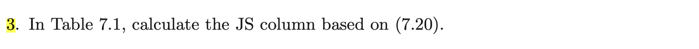
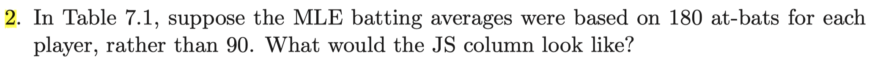
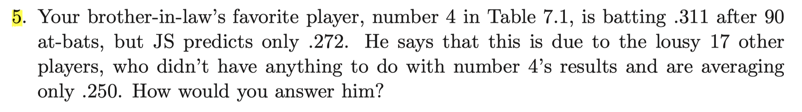

```{r setup, include=FALSE}
knitr::opts_chunk$set(echo = TRUE)
```

### Exercise 7.3

  
First, we create a vector of observed batting average. Then, calculate binomial variance $\sigma_0^2$ and then derive James stein estimator $\hat{p_i^{JS}}$ according to (7.20)
```{r}
batAvg=c(0.345, 0.333, 0.322, 0.311, 0.289, 0.289, 0.278, 0.255, 0.244, 0.233, 
         0.233, 0.222, 0.222,0.222, 0.211, 0.211, 0.200, 0.145)
JSsigma<-function(x){
  sigmasq = mean(x)* (1-mean(x)) / 90   # binomial variance sigma_0 ^2
  mean(x) + (1 - (length(x)-3) * sigmasq / ((length(x)-1)*var(x)) ) * (x-mean(x))
  # James stein estimator according to (7.20)
}
pJS = JSsigma(batAvg)
as.data.frame(round(cbind(batAvg, pJS), 3))

```  


### Exercise 7. 2

  
We should compare two column vectors $\hat p^{JS}$ where the original one is generated from the data with $n=90$ and the hypothetical another one is generated from the data with $n=180$ where $n$ is the number of at-bats used to measure batting average for every player.  
To guess what are going to happen, look at the shape of $\hat p_i^{JS}$ .
$$
 \hat p_i^{JS}= \overline{p}+\bigg\{1-\frac{(N-3)\sigma_0^2}{\sum_i (p_i-\overline{p})^2} \bigg\}(p_i-\overline{p})=\bigg\{1-\frac{(N-3)\sigma_0^2}{\sum_i (p_i-\overline{p})^2} \bigg\}p_i + \frac{(N-3)\sigma_0^2}{\sum_i (p_i-\overline{p})^2}\overline{p}
$$
where $\sigma_0^2=\frac{\overline{p}(1-\overline{p})}{n}$ . Thus we can view $\hat p_i^{JS}$ as a weighted sum of $p_i$ and $\overline{p}$. Since we consider two cases where $n=90$ and $n=180$, plug in those values. Then we can see that weight for $p_i$ gets larger and weight for $\overline{p}$ gets smaller as $n$ is changed from $90$ to $180$. This means that $\hat p_i^{JS}$ comes closer to $p_i$ and moves farther from $\overline{p}$ . Of course this happens for every $i=1, 2, \cdots , N$ where $N=180$ in this problem.  

We can explain this in heuristic way. James-Stein estimator inherits property of Bayes estimator under squared loss, which is a posterior mean. In typical cases, posterior mean can be yielded as a weighted mean of data mean and prior mean where the weight is determined by the amount of information that prior and data have respectively. If the amount of information data have grows then posterior mean tends to data mean rather than the prior mean. In James-Stein estimator, we can view the observed value $p_i$ as data and $\overline{p}$ as an estimate of prior mean. If $n$ was not $90$ but $180$, then the amount of information from data becomes higher so that James-Stein estimator comes closer to $p_i$ rather than $\overline{p}$.

Now, it is time to check visually whether our claim is true.

```{r}
JSsigma180<-function(x){
  sigmasq = mean(x)* (1-mean(x)) / 180   # binomial variance sigma_0 ^2 with n=180
  mean(x) + (1 - (length(x)-3) * sigmasq / ((length(x)-1)*var(x)) ) * (x-mean(x))
  # James stein estimator according to (7.20)
}
pJS180 = JSsigma180(batAvg)

plot(batAvg, pJS , type='n' , xlab= "mle", ylab='JS estimator', xaxs='i', yaxs='i',
     xlim=c(0.1 ,0.4), ylim=c(0.1, 0.4) )
lines(batAvg, pJS, type= 'o')
lines(batAvg, pJS180, col='blue' , type='o')
lines(batAvg, batAvg, col= 'green', type = 'o')
abline(h=mean(batAvg), col='red', lty= 'dotted')
legend('topleft', c("JS with 90 at bats" ,"JS with 180 at bats", "MLE", "Sample mean") , 
       col=c('black', 'blue', 'green', 'red'), lwd=2, lty=c('solid', 'solid', 'solid', 'dotted'))


```  

From the plot above, we can see that in both cases where $n=90$ and $n=180$, $\hat p_i^{JS}$ lies between $p_i=\hat p_i^{MLE}$ and $\overline{p}$ because they are weighted means of those two. However, the line drawn when $n=180$ is closer to $p_i$ and farther from $\overline{p}$ as we explained above.  
The same thing happens when we calculate the JS estimator based on (7.23) taking advantage of variance stabilizing transformation.

```{r}
library(purrr)

# arcsin transformation p --> x 
g1<-function(p){
  n=90
  2 * sqrt(n + 0.5) * asin(sqrt((n*p + 0.375)/(n + 0.75)))
}

# x vector transformed from p
x1=
  batAvg %>%
  map_dbl(g1)

# JS estimator function 
JS<-function(x){
  mean(x) + (1 - (length(x)-3) / ((length(x)-1)*var(x)) ) * (x-mean(x))
}  

# mu_JS
muJS1 = JS(x1)

# inverse transformation x --> p
h1<-function(mu){
  n=90
  ((n+0.75)*(sin( mu/(2*sqrt(n+0.5)) ))^2 - 0.375) / n
}

# p_JS
pJS1 =
  muJS1 %>%
  map_dbl(h1)


#repeat same process but with n=180 this time

g2<-function(p){
  n=180
  2 * sqrt(n + 0.5) * asin(sqrt((n*p + 0.375)/(n + 0.75)))
}

x2=
  batAvg %>%
  map_dbl(g2)

muJS2 = JS(x2)

h2<-function(mu){
  n=180
  ((n+0.75)*(sin( mu/(2*sqrt(n+0.5)) ))^2 - 0.375) / n
}

pJS2 =
  muJS2 %>%
  map_dbl(h2)

# Plot similar process as above

plot(batAvg, pJS1 , type='n' , xlab= "mle", ylab='JS estimator', xaxs='i', yaxs='i',
     xlim=c(0.1 ,0.4), ylim=c(0.1, 0.4)
     )
lines(batAvg, pJS1, type= 'o')
lines(batAvg, pJS2, col='blue' , type='o')
lines(batAvg, batAvg, col= 'green', type = 'o')
abline(h=mean(batAvg), col='red', lty= 'dotted')
legend('topleft', c("JS with 90 at bats" ,"JS with 180 at bats", "MLE", "Sample mean") ,
       col=c('black', 'blue', 'green', 'red'), lwd=2, lty=c('solid', 'solid', 'solid', 'dotted'))


```  


### Exercise 7.5 
  

What he said about JS estimator is not totally wrong. Only direct evidence for the true batting average $P_4$ of player number 4 is $p_4$. Other $p_i$'s are indeed indirect evidence. JS estimator takes advantage of those indirect evidence to estimate $P_4$. Derived JS estimates are weighted mean of $p_4$ and $\overline{p}$ and for the player4, since $p_4 > \overline{p}$, we have $\hat p_4^{JS}$ smaller than $p_4$ . Maybe our brother-in law is unhappy with the result of this situation, however we can say to him that by shrinking every observed batting average toward sample mean $\overline{p}$, we are able to have lower the risk of estimator for overall 18 players' true batting average. As we can see in the table 7.1, in reality, our JS estimate is more accurate than MLE compared with true batting average for player 4.


### Problem 2
We shall show that in $M=0$ case, the Bayes risk of James-Stein estimator is $NB+2/(A+1)$ . 
Our model is
$$
\mu\sim N(0, AI) \quad, \quad x|\mu \sim N(\mu, I)
$$
$$
\mu | x \sim N(Bx, BI)\quad \text{where} \quad B=\frac{A}{A+1}
$$

$$
x \sim N(0, (A+1)I) \quad, \quad S=x^Tx\sim (A+1)\chi^2(N)
$$

$$
\hat \mu ^{JS}=\hat B x \quad, \quad \hat B = 1-\frac{N-2}{S} \quad 
$$

Note that $E(S)=N(A+1)$ and $E(\frac{A+1}{S})=\frac{1}{N-2}\cdots (*)$

$$
\begin{aligned}
  E[(\hat \mu_i^{JS}-\mu_i)^2 | x] & = E[(\hat \mu_i^{JS}-E(\mu_i|x)+E(\mu_i|x) -\mu_i))^2|x] \\
  &= E[(E(\mu_i|x) -\mu_i)^2|x]+E[(\hat \mu_i^{JS}-E(\mu_i|x))^2|x]   \quad\because\text{Cross Product=0} \\
  &= Var(\mu_i|x)+(Bx_i-\hat Bx_i)^2= B+(B-\hat B)^2x_i^2 \\
  E[\|\hat \mu^{JS}-\mu\|^2\,|x]&=NB+(B-\hat B)^2 S \\
  E[\|\hat \mu^{JS}-\mu\|^2] &= NB+ E[(B-\hat B)^2 S ]
\end{aligned}
$$
Using $(*)$ above, we have
$$
\begin{aligned}
  (B-\hat B)^2 S &= (B-1+\frac{N-2}{S})^2S=C^2S-2C(N-2)+(N-2)^2\frac{1}{S} \quad \text{where} \quad C=1-B \\
  E[(B-\hat B)^2 S] &= CN-2C(N-2)+C(N-2)=CN-C(N-2)=2C=2(1-B)
\end{aligned}
$$
Therefore, 
$$
E[\|\hat \mu^{JS}-\mu\|^2] = NB+ E[(B-\hat B)^2 S ]= NB+2(1-B) =NB+2/(1+A)
$$  

### Problem 3
Let $\hat{\mu}_i$ be the $i$-th coordinate of the JS-estimator in the setting of p. 93 (of the textbook). Compare the risk of $\hat{\mu}_i$ with that of the MLE of $\mu_i$.  
$$
\begin{aligned}
  (\hat \mu_i-\mu_i)^2 &= (\hat \mu_i-x_i+x_i-\mu_i)^2 = (\hat\mu_i-x_i)^2+(x_i-\mu_i)^2+2(\hat \mu_i-x_i)(x_i-\mu_i) \\
  &=  (\hat\mu_i-x_i)^2+(x_i-\mu_i)^2 + 2(\hat\mu_i-\mu_i)(x_i-\mu_i)-2(x_i-\mu_i)^2 \\
  &=  (\hat\mu_i-x_i)^2-(x_i-\mu_i)^2 + 2(\hat\mu_i-\mu_i)(x_i-\mu_i)
\end{aligned}
$$

$$
E[(\hat\mu_i-\mu_i)(x_i-\mu_i)]=E[\hat\mu_i(x_i-\mu_i)]=E[g(x_i)(x_i-\mu_i)]
$$
where $g$ is given by 
$$
g(x_i)=\frac{1}{N}\sum_{j=1}^N x_j+\Big(1-\frac{N-3}{\sum_{j=1}^N(x_j-\overline{x})^2} \Big)\big(x_i-\frac{1}{N}\sum_{j=1}^N x_j\big)
$$
Here, every $x_j$ with $j\neq i$ is treated as fixed. By stein's identity, we have 
$$
\begin{aligned}
  E[(\hat\mu_i-\mu_i)(x_i-\mu_i)]&=E[g(x_i)(x_i-\mu_i)] = E\Big[\frac{\partial}{\partial x_i}g(x_i) \Big] \\
  &= E\Big[\frac{1}{N}+(1-\frac{1}{N})-(N-3)\frac{\partial}{\partial x_i} \frac{x_i-\frac{1}{N}\sum_{j=1}^N x_j}{\sum_{j=1}^N(x_j-\overline{x})^2}\Big] \\
  &= 1-(N-3)E\Big[\frac{(1-\frac{1}{N})S-2(x_i-\overline{x})^2}{S^2} \Big]    \quad \text{where} \quad S=\sum_{j=1}^N (x_j-\overline{x})^2
\end{aligned}
$$
$$
\begin{aligned}
E[(\hat \mu_i-x_i)^2]&=E\Big[\big(\overline{x}+(1-\frac{N-3}{S})(x_i-\overline{x})-x_i\big)^2\Big] = E\Big[\big(\frac{N-3}{S}(x_i-\overline{x})\big)^2 \Big] \\
&= (N-3)E\Big[\frac{(N-3)(x_i-\overline{x})^2}{S^2} \Big]
\end{aligned}
$$
$$
E[(x_i-\mu_i)^2]= E[(\hat\mu_i^{MLE}-\mu_i)^2]=1
$$
Combining above three results and plugging in on the first equation, we have
$$
\begin{aligned}
  E[(\hat \mu_i-\mu_i)^2] &=  E[(\hat\mu_i-x_i)^2] - E[(x_i-\mu_i)^2]  + 2E[(\hat\mu_i-\mu_i)(x_i-\mu_i)] \\
  &=(N-3)E\Big[\frac{(N-3)(x_i-\overline{x})^2}{S^2} \Big] - 1 + 2\bigg\{1-(N-3)E\Big[\frac{(1-\frac{1}{N})S-2(x_i-\overline{x})^2}{S^2} \Big]  \bigg\} \\
  &= 1 + (N-3) E\Big[\frac{(N+1)(x_i-\overline{x})^2/S-2(1-\frac{1}{N})}{S} \Big] \\
  &= E[(\hat\mu_i^{MLE}-\mu_i)^2] +  (N-3)  E\bigg[\frac{(N+1)(x_i-\overline{x})^2/S-2(1-\frac{1}{N})}{S} \bigg]
\end{aligned}
$$  
Hence, 
$$
 E[(\hat \mu_i-\mu_i)^2]-E[(\hat\mu_i^{MLE}-\mu_i)^2] =  (N-3)  E\bigg[\frac{(N+1)(x_i-\overline{x})^2/S-2(1-\frac{1}{N})}{S} \bigg]
$$
We cannot guarantee that this expectation is positive or negative for every $i\in \{1, \cdots, N\}$ . For some $i$, this expectation may be strictly positive so that $E[(\hat \mu_i-\mu_i)^2] > E[(\hat\mu_i^{MLE}-\mu_i)^2]$ . This means that not every $\hat\mu_i^{JS}$ improves $\hat\mu_i^{MLE}$ . Especially, it can happen when $\mu_i$ is genuinely outstanding (whether in a positive or negative sense) compared to others.


