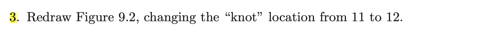
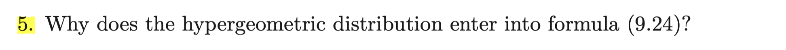

```{r setup, include=FALSE}
knitr::opts_chunk$set
knitr::opts_chunk$set(fig.width=12, fig.height=8) 
```

### Exer 9.3



First, we should bring in the dataset and make a table similar to Table 9.3 in textbook. Since the raw data records survival times in days and what we need is survival time in months, we divide the number of days by 30 and add 1 . We deal with Arm A group first.

```{r}
original<-read.table("https://web.stanford.edu/~hastie/CASI_files/DATA/ncog.txt", header=T)
data=original[c("t","d", "arm")]

library(purrr)

# Survival data in Arm A group
Adata=split(data, data$arm)$A

# A function converting survival time in days to survival time in months
month_convertor<-function(x) {x%/%30 +1}
tmonth=map_dbl(Adata$t, month_convertor)


Adat=as.data.frame(cbind(Adata$'d', tmonth)[order(tmonth), ])
colnames(Adat)[1]='d'

# Atable is a table reproducing Table 9.3 in the textbook
Atable=matrix(0, nrow=max(tmonth), ncol=2)
colnames(Atable)=c('n','y')
n=nrow(Adat)
for(i in 1:nrow(Atable)){
  Atable[i,1]=n
  # If no one is observed in t then y_t=0
  if(!any(Adat$tmonth==i)) {
    y=0
  }
  # If someone is observed in t then y_t is the number of observed death at t
  else{
    y=sum(Adat$d[which(Adat$tmonth==i)])
  }
  Atable[i,2]=y
  # n is the number of patients at risk
  # censored subjects have effect on n ( but not on y)
  n = n - length(which(Adat$tmonth==i))
}
Atable=as.data.frame(Atable)
Atable
```

Now, we should estimate hazard rate based on a cubic-linear spline. The model is given as the following
$$
\begin{aligned}
  y_k&\sim B(n_k, h_k) \quad\text{independently for} \; k=1,2,\cdots ,max(\text{observed month}) \\
  \lambda_k&=\log(h_k \;/\;(1-h_k)) \\
  \lambda_k&=x_k^T\alpha \quad \text{where} \; x_k=(1, k, (k-12)_{-}^2, (k-12)_{-}^3) \; \text{and} \; \alpha=(\alpha_0, \alpha_1, \alpha_2, \alpha_3)
\end{aligned}
$$
To estimate hazard rate $h_k$, logistic regression should be implemented. It will yield $\hat \alpha$ so that the fitted values are 
$$
\hat h_k = \frac{1}{1+\exp(-x_k^T\hat\alpha)}
$$
Note : not as typical case where the response is binary data, here response data is a binomial data.
Hence a little bit different R formula should be utilized.  

`glm( Y ~ X, family=binomial)`  
With binomial data, the response can be either a vector or a matrix with two columns.  

- If the response is a vector, it can be numeric with 0 for failure and 1 for success, or a factor with the first level representing “failure” and all others representing “success”. In these cases R generates a vector of ones to represent the binomial denominators.  
- Alternatively, the response can be a matrix where the first column is the number of “successes” and the second column is the number of “failures”. In this case R adds the two columns together to produce the correct binomial denominator.  
( Source : [https://data.princeton.edu/r/glms](https://data.princeton.edu/r/glms) ) 

```{r}
k=1:max(tmonth)
X1=k
X2=k
X2[1:12]=(X2[1:12]-12)^2
X2[13:max(k)]=0
X3=k
X3[1:12]=(X3[1:12]-12)^3
X3[13:max(k)]=0

fit= glm(cbind(Atable$y, Atable$n-Atable$y) ~ X1+X2+X3, family='binomial')
```

`fit$fitted.values` will give us fitted values $\hat h_k$ and `summary(fit)` will provide us coefficients estimates and standard errors of $\hat\alpha$ .  
But how to get standard error of $\hat h_k$ as in Figure 9.2 ? We can take advantage of bootstrap standard error.

```{r}
Boot15=0
Boot30=0
set.seed(123)
# Generate 200 numbers of bootstrap resampling
# Repeat the process above to yield hazard rates h_k
# Store 200 number h_k values at k=15 and k=30
for(j in 1:200){
  obs=nrow(Adat)
  resamp=sample(1:obs, obs, replace=T)
  resamp=sort(resamp)
  Adat_resamp=Adat[resamp,]
  Atable_resamp=matrix(0, nrow=max(tmonth), ncol=2)
  colnames(Atable_resamp)=c('n','y')
  n=nrow(Adat_resamp)
  for(i in 1:nrow(Atable_resamp)){
    Atable_resamp[i,1]=n
    if(!any(Adat_resamp$tmonth==i)) {
      y=0
    }
    else{
      y=sum(Adat_resamp$d[which(Adat_resamp$tmonth==i)])
    }
    Atable_resamp[i,2]=y
    n = n - length(which(Adat_resamp$tmonth==i))
  }
  Atable_resamp=as.data.frame(Atable_resamp)
  
  refit= glm(cbind(Atable_resamp$y, Atable_resamp$n-Atable_resamp$y) ~ X1 + X2 + X3,
             family='binomial')
  Boot15[j]=refit$fitted.values[15]
  Boot30[j]=refit$fitted.values[30]
}
```

Then we can reproduce Figure 9.2 after we do exactly same process for Arm B group

```{r}
plot(fit$fitted.values, type='l', lwd='2', xlab='Months', ylab='Deaths per Month', ylim=c(0, 0.15))
arrows(x0=15, y0=fit$fitted.values[15]-sd(Boot15), x1=15, y1=fit$fitted.values[15]+sd(Boot15),
       code=3, angle=90, length=0.1, lwd=1)
arrows(x0=30, y0=fit$fitted.values[30]-sd(Boot30), x1=30, y1=fit$fitted.values[30]+sd(Boot30),
       code=3, angle=90, length=0.1, lwd=1)


Bdata=split(data, data$arm)$B

tmonth=map_dbl(Bdata$t, month_convertor)
Bdat=as.data.frame(cbind(Bdata$'d', tmonth)[order(tmonth), ])
colnames(Bdat)[1]='d'
Btable=matrix(0, nrow=max(tmonth), ncol=2)
colnames(Btable)=c('n','y')
n=nrow(Bdat)
for(i in 1:nrow(Btable)){
  Btable[i,1]=n
  if(!any(Bdat$tmonth==i)) {
    y=0
  }
  else{
    y=sum(Bdat$d[which(Bdat$tmonth==i)])
  }
  Btable[i,2]=y
  n = n - length(which(Bdat$tmonth==i))
}
Btable=as.data.frame(Btable)

k=1:max(tmonth)
X1=k
X2=k
X2[1:12]=(X2[1:12]-12)^2
X2[13:max(k)]=0
X3=k
X3[1:12]=(X3[1:12]-12)^3
X3[13:max(k)]=0

fit= glm(cbind(Btable$y, Btable$n-Btable$y) ~ X1+X2+X3, family='binomial')


Boot15=0
Boot30=0
set.seed(123)
for(j in 1:200){
  obs=nrow(Bdat)
  resamp=sample(1:obs, obs, replace=T)
  resamp=sort(resamp)
  Bdat_resamp=Bdat[resamp,]
  Btable_resamp=matrix(0, nrow=max(tmonth), ncol=2)
  colnames(Btable_resamp)=c('n','y')
  n=nrow(Bdat_resamp)
  for(i in 1:nrow(Btable_resamp)){
    Btable_resamp[i,1]=n
    if(!any(Bdat_resamp$tmonth==i)) {
      y=0
    }
    else{
      y=sum(Bdat_resamp$d[which(Bdat_resamp$tmonth==i)])
    }
    Btable_resamp[i,2]=y
    n = n - length(which(Bdat_resamp$tmonth==i))
  }
  Btable_resamp=as.data.frame(Btable_resamp)
  
  refit= glm(cbind(Btable_resamp$y, Btable_resamp$n-Btable_resamp$y) ~ X1 + X2 + X3,
             family='binomial')
  Boot15[j]=refit$fitted.values[15]
  Boot30[j]=refit$fitted.values[30]
}

# Arm B group has a subject observed in 77 month, but for comparing with Arm A, 
# just draw fitted values h_k for k=1, 2, ... , 48
lines(fit$fitted.values[1:48], type='l', lwd='2',col='red')
arrows(x0=15, y0=fit$fitted.values[15]-sd(Boot15), x1=15, y1=fit$fitted.values[15]+sd(Boot15),
       code=3, angle=90, length=0.1, lwd=1, col='red')
arrows(x0=30, y0=fit$fitted.values[30]-sd(Boot30), x1=30, y1=fit$fitted.values[30]+sd(Boot30),
       code=3, angle=90, length=0.1, lwd=1, col='red')
legend('topright', legend=c("Arm A : chemotherapy only", "Arm B : chemotheraphy + radiation"),
       col=c('black', 'red'), lwd=c(2,2))
title(main='Parametric hazard rate estimates for Arm A vs Arm B groups' )


```

### Exer 9.5

Note that log rank test compares two hazard functions corresponding to two treatment groups. Null Hypothesis is given by
$$
H_0 : h_A(t)=h_B(t)\quad \forall \;t
$$
Denote $t_{(1)}, t_{(2)}, \cdots ,t_{(k)}, \cdots$ as the ordered failure times. Then $H_0$ can be rewritten as
$$
H_0 : h_A(t_{(k)})=h_B(t_{(k)})\quad \forall \; k
$$
For each time period $t_{k}$ , we can draw a table of death and survival for two groups A and B

| $t_{(k)}$| Died | Survived | total |
| :----:  |    :----: |    :----: | :----:|
| A  | $y_{k}$   | | $n_A$ |
| B |   |  | $n_B$ |
| total | $n_d$ | $n_s$ | $n$ | 
  
At each time period $t_{(k)}$ the numbers $n_A, n_B, n_d, n_s$ and $n$ are regarded as fixed.
Hence if $y_{(k)}$ is drawn then the other three cells are determined accordingly.  
The null distribution of $y_{(k)}$ is $H(n_d ; n, n_A)$ where $H$ stands for hypergeometric distribution.  
$$
  P(y_{(k)}=y)=\frac{\binom{n_A}{y} \cdot \binom{n_B}{n_d-y}}{\binom{n}{n_d}}
$$
Since null distribution assumes that there is no difference between hazard rates of two treatment groups A and B, drawing $y$ conditionally on $n_A, n_B, n_d, n_s$ and $n$ is a ratio of the number of choosing $y$ among $n_A$ multiplied by the number of choosing $n_d-y$ among $n_B$ to choosing $n_d$ among $n$ .  
Also, by introducing hypergeometric distribution, test statistic is given as scaled sum of $y_{(k)}-E[y_k]$ .
$$
\begin{aligned}
  y_k-E(y_k) &= y_k -\frac{n_An_d}{n}=\frac{n_An_B}{n}\Big(\frac{y_k}{n_An_B} n-\frac{n_d}{n_B} \Big) \\
  &= \frac{n_A n_B}{n}\Big(\frac{y_k}{n_An_B}(n_A+n_B)-\frac{y_k+(n_d-y_k)}{n_B} \Big) \\
  &= \frac{n_A n_B}{n} \Big(\frac{y_k}{n_B}+\frac{y_k}{n_A}-\frac{y_k}{n_B}-\frac{n_d-y_k}{n_B} \Big) \\
  &= \frac{n_A n_B}{n} \Big(\frac{y_k}{n_A}-\frac{n_d-y_k}{n_B} \Big) = \frac{n_An_B}{n}(\hat{h}_A(t_{(k)}-\hat{h}_B(t_{(k)})
\end{aligned}
$$
In other word, test statistic is scaled sum of hazard differences between two treatment groups. Therefore, it seems intuitive that we reject null distribution of no difference if the magnitude of test statistic is too large.


