```{r setup, include=FALSE}
knitr::opts_chunk$set(echo = TRUE)
```

## Exercise 10.4

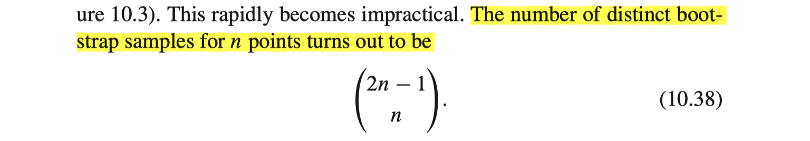
Given $n$ data points, we want to figure out number of distinct tuples 
$$
(x_1, \cdots, x_n)
$$
satisfying $x_1+\cdots+x_n=n$ and $x_i\in \{0, 1, \cdots, n\}$ for each $i=1, \cdots, n$  
It is a problem equivalent to the following : for $n$ equally shaped balls , we are going to separate those balls into $n$ ordered groups , with group of zero ball being allowed .  
The cardinality of the first group will be equal to $x_1$ and the cardinality of the second group will be equal to $x_2$ and so on.  
Hence, it is a problem of locating separation bars between those $n$ number of balls. Since we need to separate those balls into $n$ number of ordered groups, we need $n-1$ separation bars. For example, if $n=8$ and balls are represented by $\circ$ and separation bars are represented by $|$ then 
$$
\circ\;|\;\circ \; |\; \circ \, \circ \;|\, |\, |\; \circ \; |\; \circ \; |\; \circ \, \circ
$$
the above example represents the case of 
$$
(x_1, x_2, \cdots, x_n) = (1,1,2,0,0,1,1,2)
$$

Hence , the number of distinct bootstrap samples for $n$ points can be calculated by 
$$
\binom{n+(n-1)}{n}=\binom{2n-1}{n}
$$

## Exercise 10.5

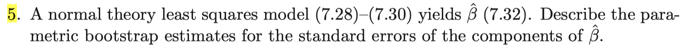
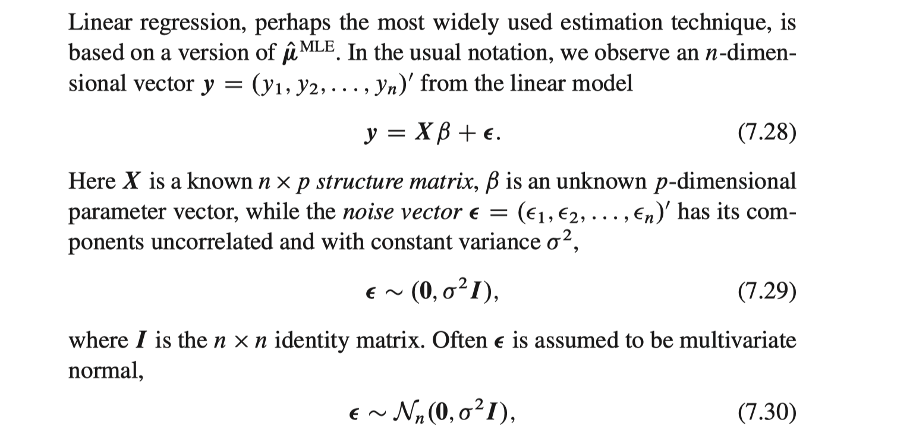
From the model above given as 
$$
\mathbf{y}\sim N(\mathbf{X}\beta, \sigma^2\mathbf{I})
$$ 

and the ordinary least squares estimates of $\beta$ is derived as

$$
\hat\beta = (\mathbf{X}^T\mathbf{X})^{-1}\mathbf{X}^T\mathbf{y}
$$

Also, the estimates for variance is calculated by MSE

$$
\hat\sigma^2 = \frac{1}{n-p}(\mathbf{y}-\mathbf{X}\hat\beta)^T(\mathbf{y}-\mathbf{X}\hat\beta)
$$

For the parametric boostrap, we generate bootstrap sample $\mathbf{y}_1^*, \cdots, \mathbf{y}_B^*$ from

$$
\mathbf{y}^*\sim N(\mathbf{X}\hat\beta, \hat\sigma^2\mathbf{I})
$$
Then, the corresponding bootstrap samples for $\hat\beta$ is computed by
$$
\hat\beta^{*(1)} = (\mathbf{X}^T\mathbf{X})^{-1}\mathbf{X}^T\mathbf{y}_1^* \;, \cdots, \; \hat\beta^{*(B)} = (\mathbf{X}^T\mathbf{X})^{-1}\mathbf{X}^T\mathbf{y}_B^*
$$
From this bootstrap sample $\hat\beta^*$'s , we can derive parametric bootstrap estimate for the standard errors of the components of $\hat\beta$ as the following :
$$
\hat{\text{se}}_{boot}(\hat\beta_1) = \text{sd}\big(\hat\beta_1^{*(1)}, \cdots, \hat\beta_1^{*(B)}\big) \;, \;\cdots\; ,\;\hat{\text{se}}_{boot}(\hat\beta_p) = \text{sd}\big(\hat\beta_p^{*(1)}, \cdots, \hat\beta_p^{*(B)}\big)
$$
where $\text{sd}(x_1, \cdots, x_n)= \sqrt{\frac{1}{n-1}\sum_{i=1}^n(x_i-\overline{x})^2}$

## Exercise 10.7

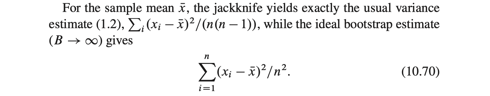

First, we shall show that for $\hat\theta=\overline{x}=\frac 1n\sum_{i=1}^n x_i$ ,
$$
\hat{\text{var}}_{jack}(\hat\theta)=\frac{\sum_{i=1}^n (x_i-\overline{x})^2}{n(n-1)}
$$
Note that 
$$
\hat{\text{var}}_{jack}(\hat\theta)=\frac{n-1}{n}\sum_{i=1}^n(\hat\theta_{(i)}-\hat\theta_{(\cdot)})^2
$$
For $\hat\theta=\overline{x}$ , 
$$
\begin{aligned}
  & \hat\theta_{(i)}=\frac{n\overline{x}-x_i}{n-1} \\
  & \hat\theta_{(\cdot)}=\frac{1}{n}\sum_{i=1}^n \hat\theta_{(i)}=\frac{1}{n}\sum_{i=1}^n \frac{n\overline{x}-x_i}{n-1} =\frac{1}{n} \frac{n^2\overline{x}-n\overline{x}}{n-1}=\overline{x} \\
  & \hat\theta_{(i)}-\hat\theta_{(\cdot)}=\frac{n\overline{x}-x_i}{n-1}-\overline{x}=\frac{\overline{x}-x_i}{n-1} \\
  & \hat{\text{var}}_{jack}(\hat\theta)=\frac{n-1}{n}\sum_{i=1}^n \frac{(\overline{x}-x_i)^2}{(n-1)^2} =\frac{\sum_{i=1}^n (x_i-\overline{x})^2}{n(n-1)}
\end{aligned}
$$

Next, we shall prove that for the original estimate $\hat\theta=S(P_0)$ and resampling estimate $\hat\theta^*=S(P)$ with resampling vector $P$, there is a linear approximation $S_L(P)$ of $S(P)$ such that $S(P_{(i)})=S_L(P_{(i)})$ . Here, $P$ is by definition a vector of nonnegative weights summing to $1$ and $P_{(i)}$ is a resampling vector corresponding to $i$-th jackknife value $\hat\theta_{(i)}$, which is given by $\frac{1}{n-1}(1, 1, \cdots, 1, 0, 1, \cdots, 1)$ . Also, $P_0$ is defined as $\frac{1}{n}(1,1,\cdots, 1)$    
We shall define $S_L(P)$ by the following :
$$
\begin{aligned}
  a&= \hat\theta_{(\cdot)} \\
  \mathbf{b}&=(n-1)(\hat\theta_{(i)}-\hat\theta_{(\cdot)}) \\
  S_L(P)&=a-\mathbf{b}^TP=\hat\theta_{(\cdot)} -(n-1)\sum_{i=1}^n p_i(\hat\theta_{(i)}-\hat\theta_{(\cdot)}) \\
  &= n\hat\theta_{(\cdot)}-(n-1)\sum_{i=1}^n p_i\hat\theta_{(i)}
\end{aligned}
$$
Observe that $S_L(P)$ is linear in $P$ . Now we shall check that $S(P_{(i)})=S_L(P_{(i)})$ for each $i=1, \cdots, n$  
$$
S_L(P_{(i)})=n\hat\theta_{(\cdot)}-(n-1)\sum_{j\neq i} \frac{1}{n-1}\hat\theta_{(j)}=\sum_{j=1}^n \hat\theta_{(j)}-\sum_{j\neq i} \hat\theta_{(j)}=\hat\theta_{(i)}=S(P_{(i)}) 
$$
Now, we should consider what ideal bootstrap estimate is.
For boootstrap estimate $\hat{\theta^*}=S(P^*)$ , ideal bootstrap estimate of variance of $\hat\theta$ can be written as $Var(\hat{\theta^*})=Var(S(P^*))$ where $P^*$ denotes the bootstrap resampling vector with the form $\frac{1}{n}(N_1, \cdots, N_n)$ and $nP^*\sim Multinomial(n, P_0)$  
Here, by the property of multinomial distribution, we have
$$
Var(nP^*)=n\begin{bmatrix} \text{Diag}(P_0)-P_0P_0^T\end{bmatrix}
$$
Now, we shall claim that 
$$
Var(S_L(P^*))=\frac{n-1}{n}\hat{\text{var}}_{jack}(\hat\theta)
$$

In above, we've shown that $S_L(P^*)$ is a linear approximation of $S(P^*)$ given as $S_L(P^*)=a-\mathbf{b}^TP^*$ . Observe that randomness only lies in $P^*$ for $a-\mathbf{b}^TP^*$. Thus ,
$$
\begin{aligned}
  Var(S_L(P^*))&= Var(a-\mathbf{b}^TP^*) = Var(\mathbf{b}^TP^*)= \mathbf{b}^TVar(P^*)\mathbf{b}=\frac{1}{n^2}\mathbf{b}^TVar(nP^*)\mathbf{b} \\
  &=\frac{1}{n^2}\mathbf{b}^Tn\begin{bmatrix} \text{Diag}(P_0)-P_0P_0^T\end{bmatrix} \mathbf{b} \\
  &= \frac{1}{n}\{\mathbf{b}^T\text{Diag}(P_0)\mathbf{b}-(P_0^T\mathbf{b})^2\}   \\
  &= \frac{1}{n}\mathbf{b}^T\text{Diag}(P_0)\mathbf{b} \quad \because \; P_0^T\mathbf{b} = \frac{n-1}{n}\sum_{i=1}^n (\hat\theta_{(i)}-\hat\theta_{(\cdot)})=0 \\
  &= \frac{(n-1)^2}{n^2}\sum_{i=1}^n (\hat\theta_{(i)}-\hat\theta_{(\cdot)})^2 = \frac{n-1}{n}\hat{\text{var}}_{jack}(\hat\theta)
\end{aligned}
$$
Hence, we've shown our claim above.   
Note that $\hat\theta=\overline{x}$ can be written as $\hat\theta=S(P_0)$ with $S(P)=\sum_{i=1}^n p_ix_i=\mathbf{x}^TP$ so that $S(P)$ is linear in $P$. Furthermore, in this case $S_L(P)$ agrees with $S(P)$ .
$$
S_L(P)= a-\mathbf{b}^T P =\hat\theta_{(\cdot)} -(n-1)\sum_{i=1}^n p_i(\hat\theta_{(i)}-\hat\theta_{(\cdot)}) =\overline{x}-(n-1)\sum_{i=1}^np_i\frac{\overline{x}-x_i}{n-1}=\overline{x}-\sum_{i=1}^n p_i(\overline{x}-x_i)=\sum_{i=1}^n p_ix_i=S(P)
$$
Hence, combining all the results above, the ideal bootstrap variance estimate of the sample mean $\overline{x}$ is given as 
$$
Var(\hat{\theta^*})=Var(S(P^*))=\frac{n-1}{n}\cdot \frac{\sum_{i=1}^n (x_i-\overline{x})^2}{n(n-1)}=\frac{1}{n^2}\sum_{i=1}^n (x_i-\overline{x})^2
$$


## Exercise 10.9
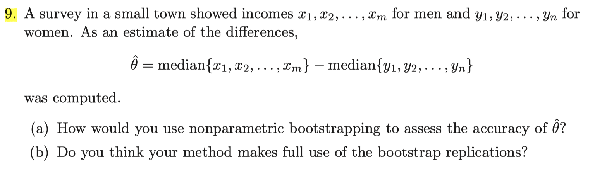
(a) First, by resampling $m$ samples among $x_1, \cdots, x_m$ , we get bootstrap median $med(X)^{*}$ . By repeating this $B$ times , we have $med(X)^{*1}, \cdots, med(X)^{*B}$. Similarly , by resampling $n$ samples among $y_1, \cdots, y_n$ , we get bootstrap median $med(Y)^*$ and by repeating this $B$ times, we have $med(Y)^{*1}, \cdots, med(Y)^{*B}$ .  
With large enough $B$, say $B=200$, we have $B$ number of $\theta^*$ values derived by 
$$
\hat\theta^{*1}=med(X)^{*1}-med(Y)^{*1}\;,\;\cdots\;,\;\hat\theta^{*B}=med(X)^{*B}-med(Y)^{*B}
$$
Then we have nonparametric bootstrap estimates for standard error of $\hat\theta$ as
$$
\hat{\text{se}}_{boot}(\hat\theta)=\sqrt{\frac{1}{B-1}\sum_{b=1}^B\big(\hat\theta^{*b}-\hat\theta^{*\cdot}\big)^2} \quad \text{where}\quad \hat\theta^{*\cdot}=\frac 1B \sum_{b=1}^B\hat\theta^{*b}
$$
(b) To make full use of the bootstrap replications, we can consider a parametric bootstrap. Since the survey has implemented in a small town, it is expected that $m$ and $n$ are not so big. Hence, it may be useful to take advantage of the power of parametric inference. For example, assume parametric model $X\sim N(\mu_x, \sigma_x^2)$ and $Y\sim N(\mu_y, \sigma_y^2)$ . Then, derive MLE of $\hat\mu_x\, ,\, \hat\mu_y\, ,\, \hat\sigma_x^2 \, ,\, \hat\sigma_y^2$ using observed data $x_1, \cdots, x_m, y_1, \cdots, y_n$. Now, generate bootstrap sample from $X^*\sim N(\hat\mu_x, \hat\sigma_x^2)$ and $Y^*\sim N(\hat\mu_y, \hat\sigma_y^2)$ . The rest of the procedure is same for the nonparametric bootstrapping above.

## Exercise 11.1
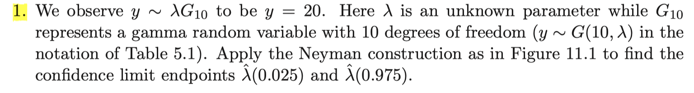
Our model is $Y|\lambda \sim \Gamma(10, \lambda)$ and the observed value is $y=20$ .
We will define some necessary notations.
$$
\begin{aligned}
  &f_\lambda(y) = \frac{1}{\Gamma(10)\lambda^{10}} y^9\exp(-y/\lambda) \quad : \text{pdf of } y|\lambda \\
  &q_\alpha(f_\lambda) = \alpha\text{-quantile of }y\; \text{for given} \;\lambda \quad i.e. \quad P_\lambda(Y\leq q_\alpha(f_\lambda))=\alpha \\ 
  &\text{For given }\alpha\in (0,1) \;,\; q_{\alpha}(f_{\lambda}) \; \text{is a function of }\lambda \\
  &I_\lambda(y) = I\big\{q_{\frac \alpha 2}(f_\lambda))\leq y\leq q_{1-\frac \alpha 2}(f_\lambda)) \big\} \\
  &C(y)=\{\lambda : I_\lambda(y)=1\} \\
  &\text{Coverage probability} : P_\lambda(\lambda\in C(Y))= P_\lambda(I_\lambda(Y)=1)=P_\lambda(q_{\frac \alpha 2}(f_\lambda))\leq Y\leq q_{1-\frac \alpha 2}(f_\lambda)))=1-\alpha
\end{aligned}
$$
Now, we shall claim that for given $\alpha\in (0,1)$ , $q_\alpha(f_\lambda)$ is an increasing function of $\lambda$.  
It is enough to show that $Y|\lambda_2$ is stochastically larger than $Y|\lambda_1$ whenever $\lambda_1\leq \lambda_2$ i.e. $P_{\lambda_1}(Y\geq r)\leq P_{\lambda_2}(Y\geq r)$ for any $r>0$ provided $\lambda_1\leq \lambda_2$
Take arbitrary $0<\lambda_1<\lambda_2$ . Write $\lambda=\lambda_1$ . Then there is a constant $c>1$ such that $\lambda_2=c\lambda$ . Take $r>0$ . Then the following holds true.
$$
\begin{aligned}
  &P_{\lambda_1}(Y\geq r) = P_{\lambda}(Y\geq r) =\frac{1}{\Gamma(10)\lambda^{10}}\int_r^\infty y^9\exp(-y/\lambda)\,dy \\ 
  &P_{\lambda_2}(Y\geq r) = P_{c\lambda}(Y\geq r) =\frac{1}{\Gamma(10)c^{10}\lambda^{10}}\int_r^\infty y^9\exp(-y/c\lambda)\,dy \\ 
  &=\frac{1}{\Gamma(10)c^{10}\lambda^{10}}\int_{r/c}^\infty c^9z^9\exp(-z/\lambda)\,c \,dz \quad \because z=\frac{y}{c}\;, \; dz=\frac1c dy\\
  &= \frac{1}{\Gamma(10)\lambda^{10}}\int_{r/c}^\infty z^9\exp(-z/\lambda)\,dz =P_\lambda\big(Y\geq \frac rc\big)\\
  &\Rightarrow \; P_{\lambda_2}(Y\geq r) = P_{c\lambda}(Y\geq r)=P_\lambda\big(Y\geq \frac rc\big) \geq P_\lambda(Y\geq r)=P_{\lambda_1}(Y\geq r) \\
  &\therefore P_{\lambda_1}(Y\geq r)\leq P_{\lambda_2}(Y\geq r)
\end{aligned}
$$
We've shown that $Y|\lambda_2$ is stochastically larger than $Y|\lambda_1$ whenever $\lambda_1\leq \lambda_2$  
Hence if we denote the cdf of $y|\lambda$ as $F_\lambda$ , then 
$$
1-F_{\lambda_1}(r)\leq 1-F_{\lambda_2}(r)\; ,\; F_{\lambda_1}(r)\geq F_{\lambda_2}(r)\;,\; F_{\lambda_1}^{-1}(\alpha)\leq F_{\lambda_2}^{-1}(\alpha)\; ,\; q_\alpha(f_{\lambda_1})\leq q_\alpha(f_{\lambda_2})
$$ 
for given $r>0$ and $\alpha\in (0,1)$ provided $\lambda_1\leq \lambda_2$ . Therefore $q_\alpha(f_\lambda)$ is an increasing function of $\lambda$ for fixed $\alpha\in (0,1)$ . Hence $\lambda\in C(y)$ is satisfied for some closed interval $[\lambda_l(y), \lambda_u(y)]$ where 
$$
  y=q_{1-\frac \alpha 2}(f_{\lambda_l(y)}) \quad \text{and}\quad y=q_\frac \alpha 2 (f_{\lambda_u(y)})
$$
We should find such $\lambda_l(y), \lambda_u(y)$ such that
$$
  F_{\lambda_l(y)}(y)=1-\frac 2 \alpha \quad \text{and} \quad F_{\lambda_u(y)}(y)=\frac \alpha 2
$$
where $F_\lambda$ is a cdf of $\Gamma(10,\lambda)$ and $y=20$ is observed.

```{r}
pgamma(20, shape=10, scale = 1) # lambda=1 
pgamma(20, shape=10, scale = 1.5) # lambda=1.5

# Since F_\lambda(y) is decreasing in \lambda , \lambda_L must lie b.w. 1 and 1.5

candidate=seq(from=1, to=1.5, length=1000)
p_L=0
lambda_L=0
for(i in 1:length(candidate)){
  lambda_L[i] = candidate[i]
  p_L[i] = pgamma(20, shape=10, scale = candidate[i])
}
i_L = which.min(abs(p_L-0.975)) # 1- 2/alpha = 0.975
lambda_L[i_L]
abs(p_L[i_L]-0.975) < 1e-5
```

```{r}
pgamma(20, shape=10, scale = 4)  # lambda=4
pgamma(20, shape=10, scale = 4.5)  # lambda=4.5

# Since F_\lambda(y) is decreasing in \lambda , \lambda_U must lie b.w. 4 and 4.5

candidate=seq(from=4, to=4.5, length=1000)
p_U=0
lambda_U=0
for(i in 1:length(candidate)){
  lambda_U[i] = candidate[i]
  p_U[i] = pgamma(20, shape=10, scale = candidate[i])
}
i_U = which.min(abs(p_U-0.025))  # 2/alpha = 0.025
lambda_U[i_U]
abs(p_U[i_U]-0.025) < 1e-5

```

Therefore, the confidence limit endpoints are computed as
$$
  \hat \lambda(0.025) = 1.1707\quad \text{and}\quad \hat\lambda(0.975)=4.1707
$$

## Exercise 11.3
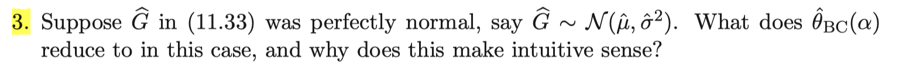
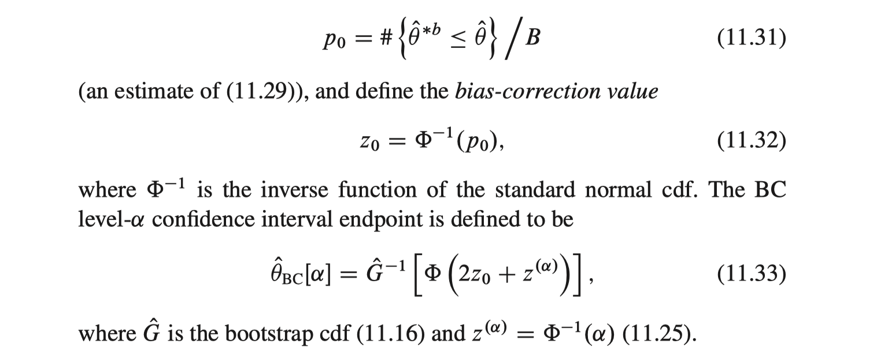

Suppose $\hat G\sim N(\hat\mu, \hat\sigma^2)$ , perfectly normal with $\hat\mu=\frac 1n \sum_{i=1}^n x_i$ and $\hat\sigma^2=\frac{1}{n-1}\sum_{i=1}^{n-1}(x_i-\overline{x})^2$ .  
Note that if $F_{\mu, \sigma}$ is a cdf of $N(\mu, \sigma^2)$ then $F_{\mu, \sigma}(x)=\Phi(\frac{x-\mu}{\sigma})$. Hence $F_{u, \sigma}^{-1}(\alpha) =\sigma \Phi^{-1}(\alpha)+\mu$ . Why?
$$
  F_{\mu, \sigma}(X\leq\sigma \Phi^{-1}(\alpha)+\mu ) = F_{\mu, \sigma}\big(\frac{X-\mu}{\sigma}\leq \Phi^{-1}(\alpha)\big)=\Phi(\Phi^{-1}(\alpha))=\alpha \quad \forall \; \alpha\in (0,1)
$$

Thus , we have
$$
\hat\theta_{BC}(\alpha) = \hat G ^{-1}(\Phi(2z_0+z_{(\alpha)})) = \hat\sigma\Phi^{-1}(\Phi(2z_0+z_{(\alpha)}))+\hat\mu=\hat\sigma(2z_0+z_{(\alpha)})+\hat\mu
$$
$\hat\theta_{BC}(\alpha)$ can be reduced to $\hat\sigma(2z_0+z_{(\alpha)})+\hat\mu$ .
If $z_0=0$ , then $\hat\theta_{BC}(\alpha)=\hat\sigma z_{(\alpha)}+\hat\mu$ . This is just a normal $\alpha$-quantile of assumed bootstrap distribution $N(\hat\mu, \hat\sigma)$ , which makes sense because when $z_0=0$, we can think that there is no bias in bootstrap distribution.  
However, if $z_0>0$ , then we can think that there is downward bias in bootstrap distribution so that adjusting upward is required. Hence $\hat\theta_{BC}(\alpha)$ is adjusted upward by $2\hat\sigma z_0$ from the original normal $\alpha$-quantile. On the other hand, if $z_0<0$, then we can think there is upward bias in bootstrap distribution so that adjusting downward is necessary. Thus $\hat\theta_{BC}(\alpha)$ is adjusted downward by $2\hat\sigma |z_0|$ from the original normal $\alpha$-quantile.

## Exercise 11.5
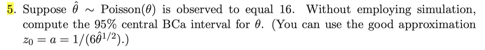
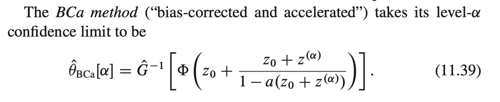
$\hat\theta\sim Poi(\theta)$ and $\hat\theta=16$ is observed. By the hint , we shall plug in $z_0=a= \frac{1}{6\hat\theta^{1/2}}=\frac{1}{24}$ on formula 11.39 with $\alpha=0.025 \; \text{and}\; 0.975$ . 

For bootstrap distribution $\hat G$, from $\hat\theta\sim Poi(\theta)$ , we expect $\hat\theta^*\sim Poi(\hat\theta)$. Thus, without employing simulation, we can plug in $\hat G = \text{cdf of } Poi(\hat\theta)$
```{r}
theta.hat = 16
z0 = 1/(6*sqrt(theta.hat))
a = 1/(6*sqrt(theta.hat))
alpha = 0.05
L = pnorm(z0+ (z0+qnorm(alpha/2)) / (1-a*(z0+qnorm(alpha/2))))
U = pnorm(z0+ (z0+qnorm(1-alpha/2)) / (1-a*(z0+qnorm(1-alpha/2))))
BCa = c(qpois(L, lambda=theta.hat) ,qpois(U, lambda=theta.hat))
BCa
```

Thus, 95% central BCa interval for $\theta$ is $(9,26)$

# Exercise 11.6
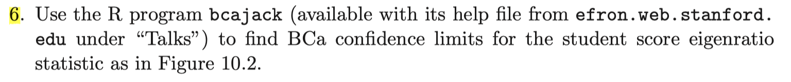
First, bring R program `bcajack` from [efron.web.stanford.edu - 2018 : Supplement files for bcajack](https://efron.ckirby.su.domains/talks/)
```{r, echo=F}
bcajack <-
function (x,B,func,..., m=nrow(x),mr=5,K=2,J=10,alpha = c(0.025, 0.05, 0.1, 0.16,.5, 0.84, 0.9, 0.95, 0.975),rou=3,catj=100, sw = 0)

{#x is nxp data matrix, func is statistic thetahat=func(x)
# can enter #bootsize B for bootsim vector tt (which is calculated)

    call <- match.call()
    if (is.vector(x)) x = as.matrix(x)
    n <- nrow(x)
    nc = ncol(x)
    ttind=ifelse(length(B)>1,1,0)
    if(ttind==1){tt=B; B=len(tt)} else tt=rep(0,B)
    t0=func(x,...)
    u=rep(0,m) ; m1=sqrt(m*(m-1))

if(m==n){   for (i in 1:n) { u[i] <- func(x[-i, ], ...)   }
     t. = (mean(u)-u)*(m-1)
     a = (1/6)* sum(t.^3)/(sum(t.^2))^1.5
     sdjack=sqrt(sum(t.^2))/m1}
 
if(m<n){ aa=ssj=rep(0,mr)
   for(k in 1:mr){
      r=n%%m; Imat=matrix(sample(1:n,n-r),m);Iout=setdiff(1:n,Imat)
		if(sw==3)return(list(Imat=Imat,Iout=Iout))
      for(j in 1:m){Ij=setdiff(1:m,j);ij=c(c(Imat[Ij,],Iout))
          u[j]=func(x[ij,])}
   t. = (mean(u)-u)*(m-1)
   aa[k] = (1/6)* sum(t.^3)/(sum(t.^2))^1.5
   ssj[k]=sqrt(sum(t.^2))/m1}
   a=mean(aa); sdjack=mean(ssj)}		   
    if(sw==2)return(list(t.=t.,sdjack=sdjack))

if(ttind==0){
    ii=sample(1:n,n*B,T); ii=matrix(ii,B)
    for(j in 1:B){ij=ii[j,]
    tt[j]=func(x[ij,],...)
    if(catj>0)if(j/catj==floor(j/catj)) cat("{", j, "}", sep = "")}
    }
    B.mean=c(B,mean(tt))
    zalpha <- qnorm(alpha); nal=length(alpha)

    sdboot0=sd(tt) # sdd=sd(dd)
      z00 <- qnorm(sum(tt < t0)/B)
 
    iles <- pnorm(z00 + (z00 + zalpha)/(1 - a * (z00 + zalpha)))
    ooo <- trunc(iles * B)
    ooo = pmin(pmax(ooo, 1), B)
    lims0 <- sort(tt)[ooo]
    standard=t0+sdboot0*qnorm(alpha)	
    lims0 <- round(cbind( lims0,standard),rou)
    dimnames(lims0)=list(alpha,c( "bcalims","standard"))
    stats0=round(c(t0,sdboot0,z00,a,sdjack),rou)
    names(stats0)=c("thet","sdboot","z0","a","sdjack")
    vl0=list(lims0 = lims0, stats0=stats0,B.mean=B.mean, call = call)
  if(K==0)return(vl0)

    pct=rep(0,nal);for(i in 1:nal)pct[i]=round(sum(tt<=lims0[i,1])/B,3)
    Stand=vl0$stats[1]+vl0$stats[2]*qnorm(alpha)
    Limsd=matrix(0,length(alpha),K); Statsd=matrix(0,5,K)

    for(k in 1:K){
    II=sample(B,B); II=matrix(II,ncol=J)
    lims=matrix(0,length(alpha),J);stats=matrix(0,5,J)
    for(j in 1:J){iij=c(II[,-j])
    ttj=tt[iij]; Bj=len(ttj)
    sdboot=sd(ttj)
      z0 <- qnorm(sum(ttj < t0)/Bj)
 
    iles <- pnorm(z0 + (z0 + zalpha)/(1 - a * (z0 + zalpha)))
    oo <- trunc(iles * Bj)
    oo = pmin(pmax(oo, 1), Bj)
    li <- sort(ttj)[oo]
    standard=t0+sdboot*qnorm(alpha)	
    sta=round(c(t0,sdboot,z0,a,sdjack),rou)
    names(sta)=c("thet","sdboot","z0","a","sdjack")
    lims[,j]=li
    stats[,j]=sta
              }
   if(sw==4)return(list(lims=lims,stats=stats)) 
   Limsd[,k]=apply(lims,1,sd)*(J-1)/sqrt(J)
   Statsd[,k]=apply(stats,1,sd)*(J-1)/sqrt(J)
   cat("{", k, "}", sep = "")
}
   limsd=rowMeans(Limsd,1); statsd=rowMeans(Statsd,1)
   limits=round(cbind(vl0$lims[,1],limsd,vl0$lims[,2],pct),rou)
   dimnames(limits)=list(alpha,c("bcalims","jacksd","standard","pct"))
   stats=round(rbind(stats0,statsd),rou)
   dimnames(stats)=list(c("est","jsd"),c("thet","sdboot","z0"
     ,"a","sdjack"))
if(sw==5)return(list(tt=tt,call=call,lims=limits,stats=stats,B.mean=B.mean))
   return(list(call=call,lims=limits,stats=stats,B.mean=B.mean))
}

```

Next, load the student score data.
```{r}
data=read.table("https://web.stanford.edu/~hastie/CASI_files/DATA/student_score.txt", header=T)
```

To take advantage of `bcajack` function created by Efron, we need to create a function `EigenRatio` which calculates the ratio $\frac{\text{largest eigenvalue}}{\text{sum of all eigenvalues}}$ of correlation matrix for input dataset.
```{r}
EigenRatio<-function(X){
  R = cor(X)
  result = max(eigen(R, only.values=TRUE)$values) / sum(eigen(R, only.values=TRUE)$values)
  return(result)
}
```

Then, we can use `bcajack` function with `EigenRatio`
```{r, warning=F}
library(matlib) # To read a `len` function in `bcajack` , we need this library
set.seed(123) 
bca_result = bcajack(x = data , B = 1000 , func = EigenRatio ,  alpha= c(0.025, 0.975), m=20, catj = 0)
bca_result
```

From the result above, for $\theta=\text{eigenratio}$ , BCa confidence limit endpoints $\hat\theta_{BCa}(0.025)$ and $\hat\theta_{BCa}(0.975)$ are given as $(0.516, 0.820)$


