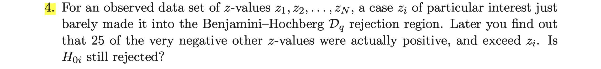

```{r setup, include=FALSE}
knitr::opts_chunk$set(echo = TRUE)
```

## Exercise 15.1


Note that for test statistics $z_1, \cdots, z_N$, we can calculate corresponding p.values $p_1, \cdots, p_N$.
Put those in order statistics, we can denote as $$p_{(1)}\leq \cdots\leq p_{(i)}  \leq \cdots \leq p_{(N)}$$ .
Note that Bonferroni procedure has constant cutoff values $\frac \alpha N$ while Holm's precedure has varying cutoff values $\frac{\alpha}{N-i+1}$ which is a function of $i$.
Observe that for any $i$ except $1$ , $\frac{\alpha}{N-i+1}$ is larger than $\frac{\alpha}{N}$. Hence Holm's procedure has larger cutoff values than Bonferroni procedure for almost all null hypotheses. It implies that Holm's procedure is more generous than Bonferroni in declaring rejections.

## Exercise 15.2


First, for testing $N = 6033$ null hypotheses, we shall use transformed z values $z_1, \cdots, z_N$ which is defined as $z_i = \Phi^{-1}(F_{100}(t_i))$ for each $i=1, \cdots, N$ where $F_{100}$ is a cdf of a $t_{100}$ distribution and $\Phi^{-1}$ is the inverse functino of a standard normal cdf. By this transformation , $z_i$ follows standard normal under the null hypothesis $H_0$. Now, we shall redraw figure 15.3 for $q=0.2$

```{r}
# transformed z_values are stored in the website of the textbook
zvals = read.table("https://hastie.su.domains/CASI_files/DATA/prostz.txt")

# sort zvalues in descending order
z = sort(c(zvals$V1), decreasing=T)
p = 0

N = 6033
q = 0.2

# calculate pvalues
for(i in 1:N){
  p[i] = pnorm(z[i], lower.tail=F)
}

# the first 50 p_values stored in `p` are corresponding to the largest z values

plot(1:50, p[1:50], xlab = "index i", ylab = "p-value")
holms = 0
Dq = 0

for(i in 1:50){
  holms[i] = q / (N-i+1)
  Dq[i] = q * i / N
}
lines(1:50, holms, col='blue', type='l')
lines(1:50, Dq, col='red', type='l')
legend('toplef', legend = c('Holms', 'Dq'), lwd = c(1,1), lty = c(1,1), col=c('blue', 'red'))
```

As we can see in the figure, if $q=0.2$ then we reject $9$ number of null hypotheses using Holm's procedure.  
On the other hand, if we take advantage of $\mathcal{D}_q$ procedure, then we reject at least $50$ number of null hypotheses. 

## Exercises 15.4



Suppose $z_i$ just barely made it into the Benjamini Hochberg $\mathcal{D}_q$ rejection region. Since $\mathcal{D}_q$ procedure rejects $z_{(1)}, \cdots, z_{(i_{max})}$ , we can assume that $i$ is equal to $i_{max}$ . Then , by the cutoff values of $\mathcal{D}_q$ algorithm, we have $$p_i = p_{(i_{max})} \leq \frac{i_{max}}{N}q$$

Later, we have found out that 25 of the very negative other z-values were actually positive and exceed $z_i$ . It implies that there are 25 p-values smaller than $p_i$ so that $p_i$ becomes $p_{i_{max}+25}$ . Thus, by the $\mathcal{D}_q$ algorithm, now $z_i$ is rejected if $$p_i = p_{(i_{max}+25)}\leq \frac{i_{max}+25}{N}q$$
Note that we have already got $p_i\leq \frac{i_{max}}{N}q$ . Thus $H_{0i}$ is still rejected.


